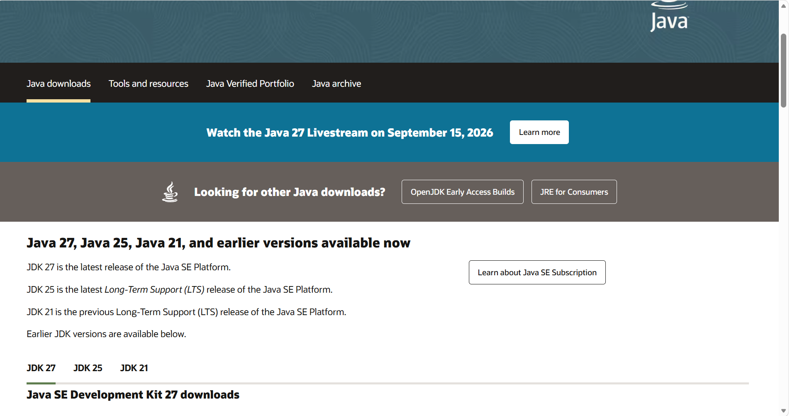
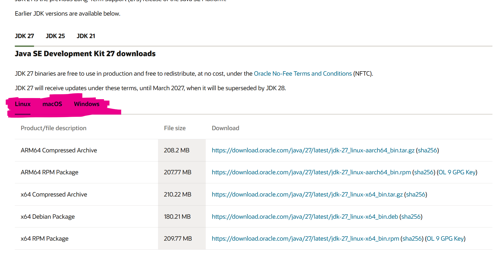
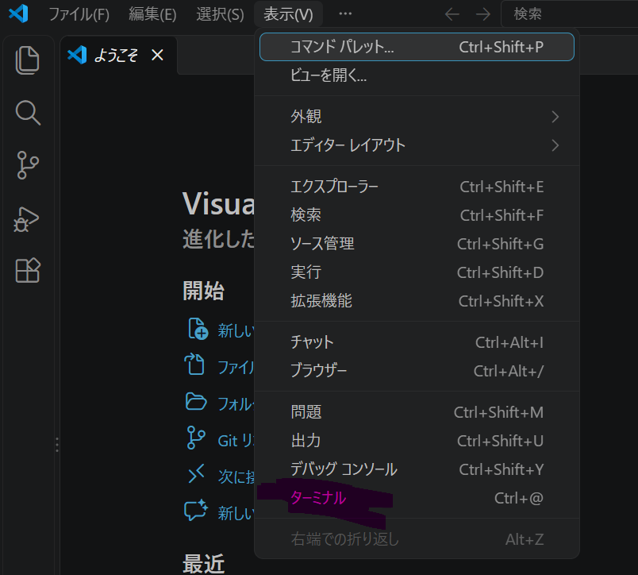
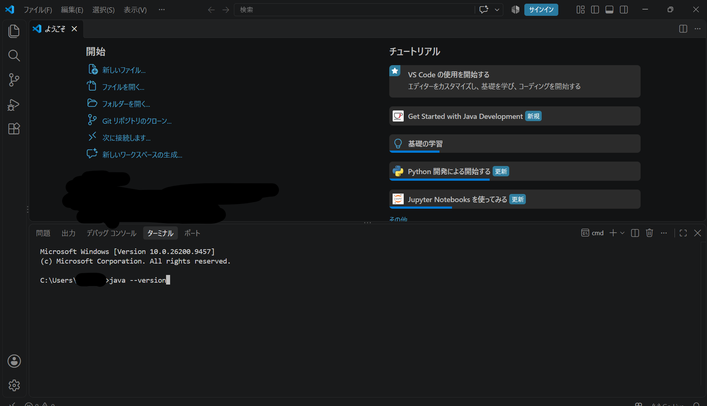
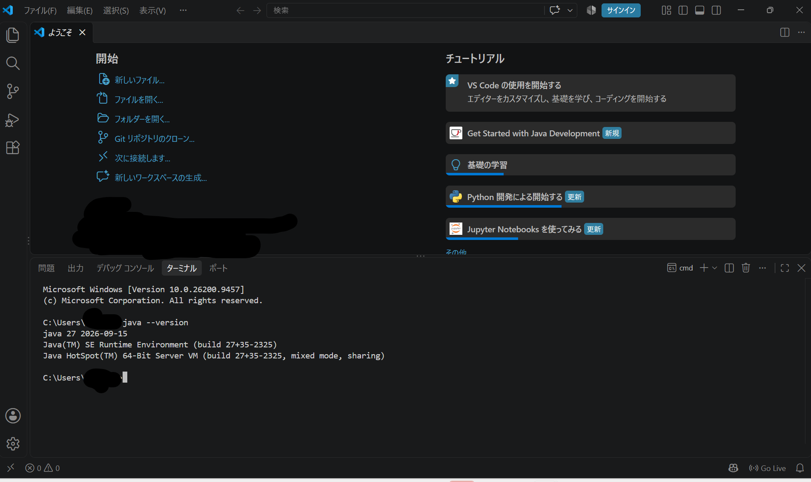
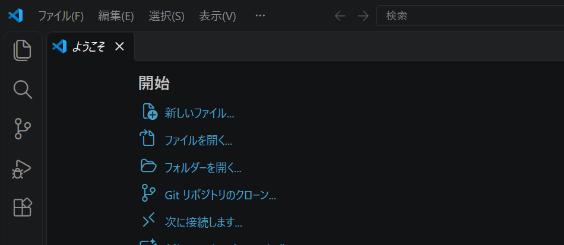
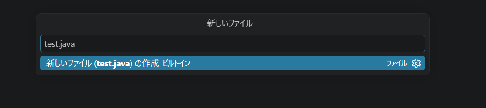
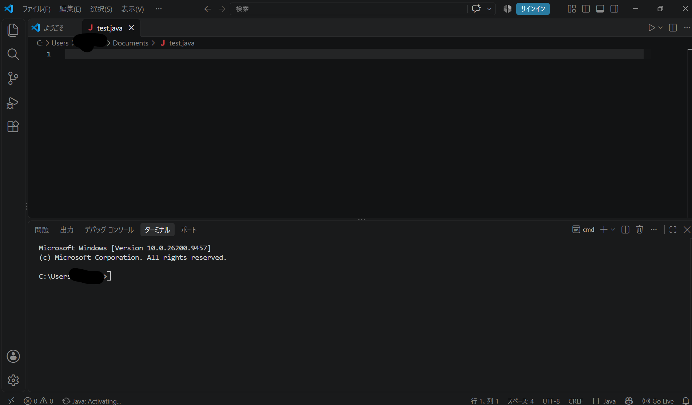

# 1. Javaを書く・動かすための準備（環境構築）

この章では、自分のパソコンで Java のコードを書いて動かせるように準備します。

プログラムを書く・動かすために必要なツールを用意し、使えるように設定することを**環境構築（かんきょうこうちく）**といいます。

> Javaが入っていないパソコンでは、Javaのプログラムは動きません。まずは道具をそろえましょう！

---

## 用意する2つの道具

1. **VS Code（Visual Studio Code）**
   * プログラムの文字（コード）を書くための「ノート」のようなアプリです。
2. **JDK（Java Development Kit）**
   * 書いたプログラムをパソコンが理解できるように翻訳して動かす「エンジン」のような仕組みです。

---

## 進め方（3つのステップ）

順番に進めていけば大丈夫です！

1.  VS Code をインストールする

2.  JDK（Javaのエンジン）を入れる

3.  ちゃんと動くか確認する

# 1-1. VS Code（コードを書くアプリ）をインストールしよう

まずは、プログラムを書くためのアプリ **VS Code（Visual Studio Code）** をパソコンに入れます。

---

## 手順 1: ダウンロードする

1. ブラウザで [VS Code 公式サイト](https://code.visualstudio.com/) を開きます。
2. 画面にある青い **「Download for Windows」**（Macの方は「Download for Mac」）ボタンをクリックします。
3. ダウンロードが始まるので、終わるまで少し待ちます。

---

## 手順 2: インストールする

1. ダウンロードしたファイル（`VSCodeUserSetup...`）をダブルクリックして開きます。

2. 契約書の画面が出たら「同意する」にチェックを入れて **「次へ」** を押します。

3. そのあとも特にこだわりの設定がなければそのまま 「次へ」 を押し続け、最後に 「インストール」 をクリックします。

4. 完了画面が出たら **「完了」** を押すと、VS Code が立ち上がります。

---

## 手順 3: 画面を日本語にする

最初は画面が英語になっているので、日本語に切り替えます。

1. VS Code の左側にある**「四角が4つ並んだマーク（拡張機能）」**をクリックします。


2. 上の検索窓に `Japanese` と入力します。

3. 一番上に出てくる **「Japanese Language Pack for Visual Studio Code」** の **「Install」** ボタンを押します。

4. 右下に「Restart」というボタンが出たらクリックします。VS Code が再起動して日本語になります！

> **※「Restart」ボタンを消してしまった場合**
> 右下の通知を閉じてしまった場合は、VS Code を一度バツボタンで閉じて、もう一度立ち上げ直せば日本語化が反映されます。

# 1-2. JDK（Javaのエンジン）を入れよう

次に、Java を動かすためのエンジンである **JDK** を準備します。
VS Code の便利機能を使うと、クリック数回で自動的に完了します！

---

## 手順: セットアップ

1. [Oracle](https://www.oracle.com/jp/java/technologies/downloads/#jdk27-windows) を開く

2. このような画面になっていることを確認する。


3. 下にスクロールしピンクのマーカーで塗られたところからLinux, mac, windowsを選びクリックしてください。


4. 自分のパソコンの機種にあったものを選んでダウンロード
(AIなどに聞いてやってもらうとできると思います。もしどうしてもわからない人向けに
Linuxなら　「x64 Compressed Archive」
MacOSなら　「ARM64 DMG Installer」
Windowsなら　「x64 Installer」
を選んでおけば大抵うまくいきます。しかしこれは最終手段としてやるようにして基本は調べてダウンロードしてください)

##　VS Cordのセットアップ

1. **VS Code** を開きます。

2. 左側のメニューから**「四角が4つ並んだマーク（拡張機能）」**をクリックします。

3. 検索窓に `Extension Pack for Java` と入力します。

4. **「Extension Pack for Java」**（Microsoft製）を見つけたら、**「インストール」** ボタンを押します。

これで、Java を書く・動かすために必要な JDK や設定がインストールされます。

# 1-3. ちゃんと準備できたか確認しよう（動作確認）

最後に、Java がパソコンで正しく動く状態になったか確かめてみましょう！

---

## 手順 1: 画面下の黒い枠（ターミナル）を開く

1. VS Code の上のメニューから **「ターミナル」 ＞ 「新しいターミナル」** をクリックします。


2. 画面の下側に黒い（または白っぽい）文字が打てる画面が開きます。

---

## 手順 2: 確認用のコマンドを打ってみる

1. ターミナルに以下の文字を入力して、キーボードの **Enter** を押します。

```bash
java --version
```


画面に以下のように Java のバージョン数字（例: openjdk 17 ～～ や java 21 ～～　、java 27 ～～ など）が表示されればOKです。


このコードは今入っているJavaのバージョンを確認することができます。

## うまくいかない場合

「コマンドとして認識されていません」などのエラーが出る場合は、VS Code を一度閉じて開き直してから、もう一度試してみてください。

2. 続いてもう一つ「コンパイラ」というプログラムを変換する機能を使えるかの確認をします。

```bash
javac --version
```

このコマンドを入力したのちenterを押してjavac 17.0.10 やjavac 21 、javac 27などと表示されれば成功です

## コードを作れる環境づくり

1. 新しいファイルを作成を押す


2. javaファイルをつくる。

ファイル名は何でもよいが「○○○○.java」のように最後に「.java」をつけるようにしよう

ここではファイル名を「test.java」にする


3. スクショのように入力できる環境になったら完成


## 前後のページ

← 前へ：[00_Javaとは](../00_Javaとは/Javaとは.md) / 次へ：[02_最初のプログラム](../02_最初のプログラム/最初のプログラム.md) →