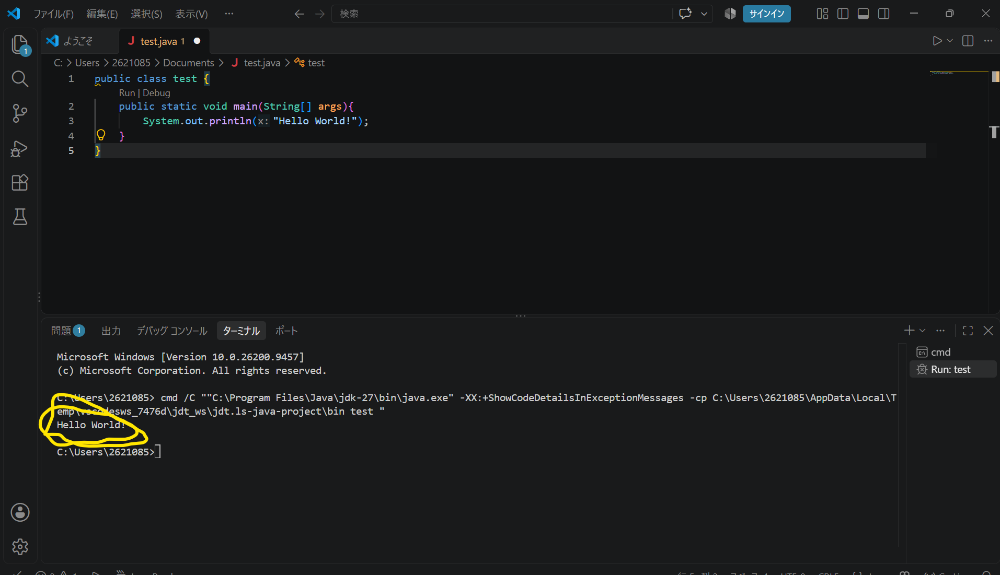

# 2. 最初のプログラム

この章では、Java で最初のプログラムを作成して実行します。題材としてまずはとにかく一行表示してみます。

```text
Hello World!
```

---

## 2-1. なぜ最初に文字を表示するの？

文字を出すのがとても簡単で最初から難しいことをやる必要はないからです。

まずは、

```java
public class {
    public static void main(String[] args){
        // コンソールに "Hello world!" を表示させる
        System.out.println("Hello World!");
    }
}
```

を動かします。

## 2-2. コードの解説

"class" や "public static void main" と難しそうなコードがありますが一旦置いてもらって構いません。

ここで見てほしいのは

```text
System.out.println("Hello World!");
```

のコードです。

このコードにある

```text
System.out.println("");
```

が大事な役割を担っています。

この()のなかにある二つの""(ダブルクォーテーション)の間に表示させたい文字を入れると見事、その文字が表示されます。

```text
例：
System.out.println("apple");
System.out.println("あいうえお");
```

## 2-3. やってみよう

実際にこのコードを打ってみましょう

```java
public class {
    public static void main(String[] args){
        // コンソールに "Hello world!" を表示させる
        System.out.println("Hello World!");
    }
}
```

このコードを画像のように入力したあと右上の三角形を押して下のターミナルを見るとHello Worldが出ていたら成功です。


## よくあるミス

1. ;(セミコロン)を入れ忘れる

'''text
NG
System.out.println("Hello World!")
'''

2. 全角で書いている

'''text
NG
System.out.println（”Hello World!”）;
'''

3. 小文字で打っている

'''text
NG
system.out.println("Hello World!");
'''

ほかにも「l(エル)」を「i(アイ)」と誤字をしていたりがあるので困ったらコピペして頂ければと思います。

← 前へ：[01_環境構築](../01_環境構築/環境構築.md) / 次へ：[03_コメント](../03_コメント/コメント.md) →