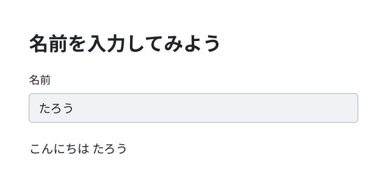

# 完成したブラウザアプリを保存して動かす

ブラウザの入力欄に名前を入れると、その名前で挨拶を表示するアプリです。完成したSt1のコードを保存して動かします。



公開サンプルをもとにした画面構成図です。`たろう` は入力する名前の例です。

このアプリは自分のパソコンで起動し、ブラウザで操作します。

PythonとVS Codeをまだ使えない場合は、先に準備します。準備後は、このページへ戻ってください。

[進む：Pythonを書いて動かす準備をする](../../../基礎編_ゆっくり学びたい人へ/教材/01_環境構築/環境構築ガイド.md)

## 完成コードを保存する

1. 練習用の新しいフォルダを作ります。Windowsはエクスプローラーの空いている場所を右クリックして **新規作成 → フォルダー**、macOSはFinderで **ファイル → 新規フォルダ**、Linux（GNOMEの「ファイル」）は空いている場所を右クリックして **新しいフォルダー** を選びます。ここでは `browser_practice` とします。browser は「ブラウザ」、practice は「練習」という意味です。ファイル名の greeting は「挨拶」という意味です。
2. 下の完成コードへのリンクを開きます。GitHubのファイル画面で **Raw** を開くと、コードだけが表示されます。
3. Windows / Linuxは Ctrl + A、Ctrl + C、macOSは Command + A、Command + C を押して、コード全体をコピーします。
4. VS Codeで新しいファイルを開き（Windows / Linuxは Ctrl + N、macOSは Command + N）、コード全体を貼り付けます（Windows / Linuxは Ctrl + V、macOSは Command + V）。
5. Windows / Linuxは Ctrl + S、macOSは Command + S を押し、練習用フォルダに `streamlit_greeting.py` という名前で保存します。末尾の `.py` まで入力します。

[完成コードを開く：streamlit_greeting.py](../../../基礎編_ゆっくり学びたい人へ/教材/St01_最初のブラウザ画面/streamlit_greeting.py)

このサンプルは、保存したPythonファイル1つで動きます。

## 保存したフォルダへ移動する

これからは、保存した `streamlit_greeting.py` を動かします。まず、そのファイルが入ったフォルダの場所をコピーします。場所を表す文字列を「パス」と呼びます。

- Windows：エクスプローラーで練習用フォルダを開き、上部のアドレス欄をクリックします。フォルダのパス全体を Ctrl + C でコピーします。
- macOS：Finderで練習用フォルダを選択し、Option + Command + C でパスをコピーします。ファイルではなくフォルダを選びます。
- Linux（GNOMEの「ファイル」の例）：練習用フォルダを開き、Ctrl + L で場所の入力欄を出し、Ctrl + C でパスをコピーします。

1. VS Codeの **表示（View）→ ターミナル（Terminal）** を選び、ターミナルを開きます。ターミナルは、文字で操作を入力する場所です。
2. 次の形で入力します。引用符の中を、上の操作でコピーしたフォルダのパスに置き換えます。Windowsは Ctrl + V、macOSは Command + V、Linuxは Ctrl + Shift + V で貼り付けます。
3. Enter キーを押します。

```text
cd "コピーした練習用フォルダのパス"
```

`cd` は、ターミナルで使うフォルダを変える操作です。コードを書いた欄には入力しません。`PS C:\Users\...>` など、すでに表示されている文字も入力しません。

## ブラウザ画面を作る道具を追加して起動する

このアプリは **Streamlit（ストリームリット）** という追加の道具を使います。練習用フォルダの `.venv` に、このアプリ専用のPython実行環境を作り、そこへStreamlitを追加します。追加するときはインターネット接続が必要です。

### Windows

専用の実行環境を作ります。`-m venv` は、その環境を作る指定です。

1. VS Codeの **表示（View）→ ターミナル（Terminal）** でターミナルを開きます。前の操作から続ける場合は、同じターミナルを使います。
2. 次のコマンドを、そのターミナルに入力します。
3. Enter キーを押します。

```text
python -m venv .venv
```

作成が終わったら、その環境へStreamlitを追加します。`-m pip install streamlit` は、指定したPythonの環境へStreamlitを追加する指定です。

1. VS Codeの **表示（View）→ ターミナル（Terminal）** でターミナルを開きます。前の操作から続ける場合は、同じターミナルを使います。
2. 次のコマンドを、そのターミナルに入力します。
3. Enter キーを押します。

```text
.\.venv\Scripts\python.exe -m pip install streamlit
```

追加が終わったら、保存したアプリを起動します。`-m streamlit run` の後ろに、動かすファイル名を書きます。

1. VS Codeの **表示（View）→ ターミナル（Terminal）** でターミナルを開きます。前の操作から続ける場合は、同じターミナルを使います。
2. 次のコマンドを、そのターミナルに入力します。
3. Enter キーを押します。

```text
.\.venv\Scripts\python.exe -m streamlit run streamlit_greeting.py
```

### macOS / Linux

専用の実行環境を作ります。`-m venv` は、その環境を作る指定です。

1. VS Codeの **表示（View）→ ターミナル（Terminal）** でターミナルを開きます。前の操作から続ける場合は、同じターミナルを使います。
2. 次のコマンドを、そのターミナルに入力します。
3. Enter キーを押します。

```text
python3 -m venv .venv
```

作成が終わったら、その環境へStreamlitを追加します。`-m pip install streamlit` は、指定したPythonの環境へStreamlitを追加する指定です。

1. VS Codeの **表示（View）→ ターミナル（Terminal）** でターミナルを開きます。前の操作から続ける場合は、同じターミナルを使います。
2. 次のコマンドを、そのターミナルに入力します。
3. Enter キーを押します。

```text
.venv/bin/python -m pip install streamlit
```

追加が終わったら、保存したアプリを起動します。`-m streamlit run` の後ろに、動かすファイル名を書きます。

1. VS Codeの **表示（View）→ ターミナル（Terminal）** でターミナルを開きます。前の操作から続ける場合は、同じターミナルを使います。
2. 次のコマンドを、そのターミナルに入力します。
3. Enter キーを押します。

```text
.venv/bin/python -m streamlit run streamlit_greeting.py
```

ブラウザが開き、「名前を入力してみよう」という見出しと、「名前」の入力欄が出ます。自動で開かない場合は、ターミナルの `Local URL:` の後ろに表示されたアドレスをコピーし、ブラウザ上部のアドレス欄へ貼り付けてEnter キーを押します。Local URLは「自分のパソコンで開くアドレス」という意味です。

## 名前を入力する

1. ブラウザの「名前」の入力欄をクリックします。
2. キーボードで `たろう` と入力し、Enter キーを押します。入力するのは名前だけです。
3. 入力欄の下に `こんにちは たろう` と表示します。
4. 入力欄の `たろう` を消して `さくら` に変え、Enter キーを押すと、`こんにちは さくら` に変わります。

終了するときは、VS Codeの **表示（View）→ ターミナル（Terminal）** で実行中のターミナルを開き、Ctrl + C を押します。ブラウザのタブを閉じるだけでは、アプリは動き続けます。

---

[進む：コードを読んで、見出しや入力欄を変更する](../../../基礎編_ゆっくり学びたい人へ/教材/St01_最初のブラウザ画面/最初のブラウザ画面.md)

[戻る：作りたい完成品を選ぶ](../../目次.md)
