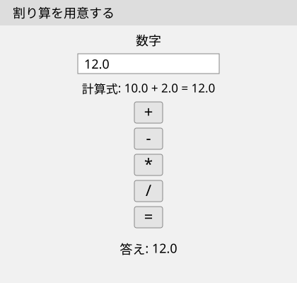
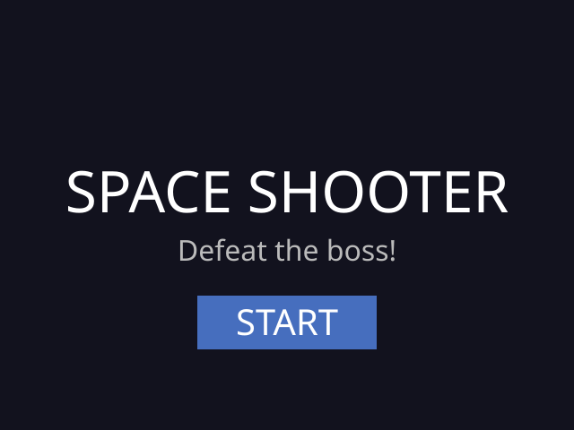

# 基礎編：さっさと学びたい人へ：目次

> **「作れるものを見て選びたい！完成した画面はどこ？」**

まず、動かしてみたい完成品を選んでください。各リンク先に、コードの保存・起動・操作の手順があります。

## 何を作りたい？

### 関数電卓を作りたい

数字・小数点・四則演算のボタンとsin・cosを使える関数電卓です。sin・cosは、斜めの棒の角度から高さや横の長さの割合を求める計算です。Tkinter（ティーケーインター）という画面を作る道具で作る電卓です。

**数字と計算記号が一つの盤面に並ぶ完成した関数電卓を動かせます。** たとえば電卓画面の「C」「1」「.」「5」「+」「2」「.」「5」「=」の各ボタンを順に押すと、結果の欄に `答え: 4` と表示されます。電卓画面の「C」「0」「cos」の各ボタンを順に押すと、結果の欄に `答え: 1` と表示されます。小数の答えは有効数字を最大12桁まで残して表示します。有効数字は、最初に現れる0以外の数字から数えた桁です。表示を整えても、計算の誤差はなくなりません。

公開サンプルをもとにした画面構成図です。実際の色や文字の形はパソコンによって変わります。

[進む：関数電卓を保存して動かす](./教材/完成品の入口/電卓を動かす.md)

[進む：電卓を最初から作る](../基礎編_ゆっくり学びたい人へ/教材/Tk01_最初のウィンドウ/最初のウィンドウ.md)

### シューティングゲームを作りたい

宇宙船を矢印キーで動かし、Spaceキーで弾を撃って敵とボスを倒すゲームです。pygame-ce（パイゲーム・シーイー）というゲーム画面を描く道具で作るゲームです。

**タイトル画面から始めて、ゲームオーバーやクリア後にタイトルへ戻るところまで入った完成サンプルを動かせます。** 完成コードを上から読む教材は、起動・画面やフォントの準備・画像の読み込み・自機の開始位置と移動の4章まで公開しています。

公開サンプルをもとにした画面構成図です。SPACE SHOOTERは「宇宙のシューティング」、Defeat the boss!は「ボスを倒そう」、STARTは「開始」という意味です。

[進む：完成ゲームを保存して遊ぶ](./教材/20_完成ゲームを読む/01_完成ゲームを動かす.md)

[進む：完成ゲームのコードを読む目次](./教材/20_完成ゲームを読む/目次.md)

[進む：ゲームを最初から作る](../基礎編_ゆっくり学びたい人へ/教材/Pg01_最初のゲーム画面/最初のゲーム画面.md)

### ブラウザで動くアプリを作りたい

**ブラウザの入力欄に名前を入れると、その名前で挨拶するアプリを動かせます。** Streamlit（ストリームリット）というブラウザ画面を作る道具で作るアプリです。

自分のパソコンで起動し、ブラウザで操作してください。名前を変えると、表示する挨拶も変わります。

公開サンプルをもとにした画面構成図です。`たろう` は入力する名前の例です。

[進む：完成したブラウザアプリを保存して動かす](./教材/完成品の入口/ブラウザアプリを動かす.md)

[進む：ブラウザアプリのコードを読む・変更する](../基礎編_ゆっくり学びたい人へ/教材/St01_最初のブラウザ画面/最初のブラウザ画面.md)

## 動かす前の準備

PythonとVS Codeをまだ使えない場合は、コードを書いて実行するための準備をしてください。準備後は、選んだ完成品のページへ戻ってください。

[進む：Pythonを書いて動かす準備をする](../基礎編_ゆっくり学びたい人へ/教材/01_環境構築/環境構築ガイド.md)

## やりたい処理から探す

作っている途中で必要になった処理は、こちらから探せます。19項目それぞれに短いコード例と、保存・実行・変更の手順があります。

Webから天気のデータを取り出すプログラムは、結果をターミナルへ表示します。ブラウザで操作するアプリを作る場合は、上の「ブラウザで動くアプリ」を選んでください。

### 文字を表示する・入力して計算する

[好きなメッセージを画面に表示したい](./教材/01_メッセージを表示する/好きなメッセージを画面に表示したい.md)

[名前を入力して挨拶したい](./教材/02_名前を入力して挨拶する/名前を入力して挨拶したい.md)

[入力した数字を2倍にしたい](./教材/03_入力した数字を2倍にする/入力した数字を2倍にしたい.md)

[2つの数字で足し算・引き算・掛け算・割り算をしたい](./教材/04_2つの数字で四則演算する/2つの数字で足し算・引き算・掛け算・割り算をしたい.md)

[点数によって表示するメッセージを変えたい](./教材/05_点数でメッセージを変える/点数によって表示するメッセージを変えたい.md)

[同じメッセージを何回も表示したい](./教材/06_メッセージを繰り返し表示する/同じメッセージを何回も表示したい.md)

[「終了」と入力するまで、入力と表示を続けたい](./教材/07_終了と入力するまで続ける/終了と入力するまで入力と表示を続けたい.md)

[同じ挨拶のコードを何度も書かずに使いたい](./教材/08_挨拶の処理をまとめる/同じ挨拶のコードを何度も書かずに使いたい.md)

### 点数や名前をまとめる

[複数の点数をまとめて合計したい](./教材/09_点数をまとめて合計する/複数の点数をまとめて合計したい.md)

[1人分の名前と点数をまとめて扱いたい](./教材/10_名前と点数をまとめる/1人分の名前と点数をまとめて扱いたい.md)

### ファイルに残す・別のファイルや道具を使う

[書いたメモをファイルに保存したい](./教材/11_メモをファイルへ保存する/書いたメモをファイルに保存したい.md)

[ファイルに保存したメモを読みたい](./教材/12_ファイルのメモを読む/ファイルに保存したメモを読みたい.md)

[数字以外を入力したときに、案内を表示したい](./教材/13_入力ミスの案内を表示する/数字以外を入力したときに案内を表示したい.md)

[長くなったコードを別のPythonファイルに分けて使いたい](./教材/14_別のファイルの処理を使う/長くなったコードを別のPythonファイルに分けて使いたい.md)

[1から10までの数字をランダムに選んで表示したい](./教材/15_数字をランダムに選ぶ/1から10までの数字をランダムに選んで表示したい.md)

[名前と点数を表のファイルへ保存して読みたい](./教材/17_名前と点数を表のファイルへ保存する/名前と点数を表のファイルへ保存して読みたい.md)

[名前と点数の組をファイルへ保存して読みたい](./教材/18_名前付きの情報をファイルへ保存する/名前と点数の組をファイルへ保存して読みたい.md)

表のファイルはCSV、名前と値の組を記録するファイルはJSONという書き方です。各ページで保存と読み込みの両方を試せます。

### Webのデータを読む

[Webから天気を読むための道具を追加したい](./教材/16_Webのデータを読む道具を追加する/Webから天気を読むための道具を追加したい.md)

[今の気温と湿度をWebから調べたい](./教材/19_Webから天気を取得する/今の気温と湿度をWebから調べたい.md)

## Webサイトを公開したい場合

Webサイトを作って公開する専用の教材は準備中です。上のブラウザアプリは、自分のパソコンで起動して使うサンプルです。

[進む：応用編の公開状況を見る](../応用編_ゆっくり作りたい人へ/教材/準備中.md)

---

[進む：この系列の公開状況を見る](./教材/準備中.md)

[進む：Pythonを順に学ぶ](../基礎編_ゆっくり学びたい人へ/初めに.md)

[戻る：この系列の入口](./初めに.md)

[戻る：Python教材の入口](../初めに.md)
