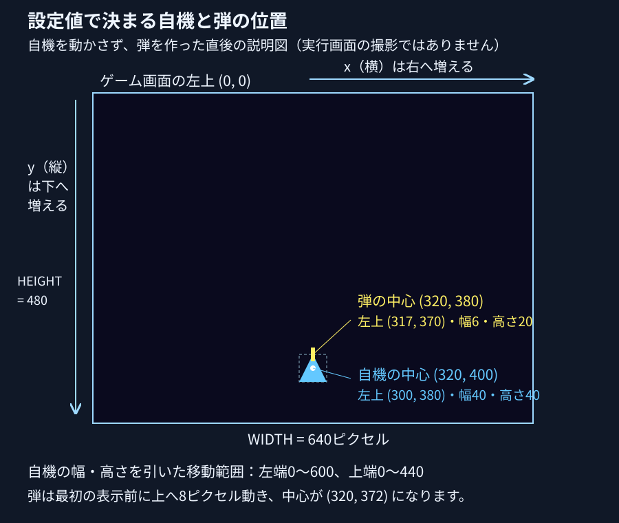

# Pg4. pygame「弾を発射する」

Pg3では、プレイヤーを矢印キーで動かせるようになりました。でも、シューティングゲームなのに、まだ弾を撃てません。

> **「動くだけ？弾を撃ちたい！」**

シューティングゲームでは、矢印キーで自機を動かし、スペースキーで弾を撃つ慣例があります。この章のプログラムもその慣例に合わせ、スペースキーを押すたびに自機から弾を発射します。前の弾が飛んでいる間にも、次の弾を撃てます。敵は次の章で加えるため、今回は弾が上へ飛んでいくところを確かめてください。

---


## Pythonファイルの保存場所

この章のPythonファイルは、練習用フォルダ内の `src` へ保存してください。

この章のコードを保存する練習用フォルダを1つ選んでください。まだない場合は、保存したい場所で、Windowsはエクスプローラーの **新規作成 → フォルダー**、macOSはFinderの **ファイル → 新規フォルダ**、Linux（GNOMEの「ファイル」）は右クリックの **新しいフォルダー** を選び、練習用フォルダを作ってください。

練習用フォルダの中で、Windowsはエクスプローラーの空いている場所を右クリックして **新規作成 → フォルダー**、macOSはFinderの **ファイル → 新規フォルダ**、Linux（GNOMEの「ファイル」）は空いている場所を右クリックして **新しいフォルダー** を選んでください。フォルダ名を `src` と入力してEnterキーを押すと、練習用フォルダの中に `src` ができます。すでに `src` がある場合はそのフォルダを使い、保存済みのコードは必要な変更だけを行ってください。

VS Codeで開くフォルダと、ターミナルの `cd` で移動するフォルダは、`src` の一つ上の練習用フォルダです。保存先を選ぶときは `src` を開き、起動するときは練習用フォルダから `src/main.py` を指定してください。実行手順のコマンドは、この練習用フォルダから入力してください。

専用のPythonを用意する `.venv` は、`src` の一つ上の練習用フォルダに置いてください。

## この章のファイルを保存する

下のリンクを1つずつ開き、GitHubの **Raw** でコードだけを表示してください。全体をコピーし、VS Codeの新しいファイルへ貼り付けて、表と同じ名前で、練習用フォルダ内の `src` へ保存してください。Windows / LinuxはCtrl + A、Ctrl + C、Ctrl + N、Ctrl + V、Ctrl + S、macOSは対応するCommandキーの操作を使ってください。

実行用コードがある章では、起動するファイルを `main.py` に揃えています。Pg15は次の学習先を選ぶ案内ページなので、実行用コードはありません。`main.py` はpygameを使う準備をし、`game.py` の `Game` を起動します。各章で追加するゲームの機能は、`game.py`、`battle.py`、`enemy.py` など役割を持つファイルに書きます。`main.py` は変更せず、補助ファイルはこの章の版で揃えて保存してください。この章だけを保存して動かせます。

| ファイル | 役割 | 前章からの違い |
| --- | --- | --- |
| [main.py](./src/main.py) | `main.py` はpygameを使う準備をし、`game.py` のゲーム全体の処理を開始します | 同じ |
| [battle.py](./src/battle.py) | Battle（戦闘）：自機と弾の一覧を管理し、PlayerとBulletへ移動・描画を依頼する | 追加 |
| [bullet.py](./src/bullet.py) | Bullet：弾の位置・移動・画面外判定・描画 | 追加 |
| [game.py](./src/game.py) | Game（ゲーム）：ウィンドウを用意し、操作確認・Battleへの更新と描画の依頼・表示を繰り返す | 変更 |
| [player.py](./src/player.py) | Player：自機の位置・移動・発射・描画 | 変更 |
| [settings.py](./src/settings.py) | 画面の大きさ、更新回数の上限、自機の初期位置、自機と弾の移動量をまとめる | 追加 |


**実行するファイルは `main.py` です。**

## 起動してから1回の更新が終わるまで

`main.py` を実行すると、PythonはPygameを準備し、`Game()` で画面と戦闘を作って `Game.run()` を始めます。`Game.run()` は、キー入力やウィンドウを閉じる操作を確認し、`Battle` へ自機と弾の位置更新・描画を依頼して、描いた画面を表示します。画面更新の速さは `self.clock.tick(settings.FPS)` で1秒あたり最大 `settings.FPS` 回に抑えます。

`self` はそのクラスから作ったもの自身です。`self.player` はその戦闘が持つ自機、`self.bullets` はその戦闘が持つ弾の一覧です。`__init__` は作るときの初期値を用意します。`from player import Player` は同じフォルダのplayer.pyから自機の型を読み込む指定です。

`main.py` を直接実行すると、Pythonは `main()` を動かし、`game.py` の `Game` がゲーム画面を開きます。別のPythonファイルから `main.py` を読み込んだだけでは、`main()` は動かず、ウィンドウも開きません。読者がウィンドウの閉じるボタンを押すと、`Game.handle_events()` は `pygame.event.get()` から閉じる操作の知らせ `pygame.QUIT` を受け取り、`self.running` を `False` にします。`Game.run()` はその値を見て画面更新の繰り返しを終え、`main.py` に戻ります。

`main.py` の `try:` の下にはゲームの起動と実行を書きます。Pythonはその処理が正常に終わった場合も途中でエラーが起きた場合も、`finally:` の下にある `pygame.quit()` を実行してPygameを終了します。エラーが起きた場合は、Pygameを終了してからPythonがエラーを表示します。

### 起動用の `main.py`

VS Codeの左側のファイル一覧で、練習用フォルダの `src/main.py` を開いてください。Windows / LinuxはCtrl + A、macOSはCommand + Aでコード全体を選び、次の全体コードをコピーして貼り付けてください。Windows / LinuxはCtrl + S、macOSはCommand + Sで `src/main.py` を保存してください。この章の処理を説明するコメントもファイルに保存されます。

元ファイル：[main.py 全体](./src/main.py)。

```python
# main（開始する処理）へ、Pygameの準備・ゲームの実行・終了後の片付けをまとめます。
# 弾の移動量はsettings.pyのBULLET_SPEED、位置を変える計算はbullet.pyのmoveで変更します。起動はmain.pyです。
# pygameは、ゲーム画面・キー入力・描画を扱う道具です。
import pygame
# 同じsrcフォルダのgame.pyから、画面とゲームの進行をまとめたGame（ゲーム）を読み込みます。
from game import Game

# defは名前を付けた処理の定義。main()と書くと、Pythonが下の字下げした処理を実行します。
def main():
    # Pygameが画面やキー入力を使うための準備をします。ウィンドウを作るのは次のGame()です。
    pygame.init()
    # ゲームが終わった場合も、このtry内でエラーが起きた場合も、finallyでPygameを片付けます。
    try:
        # gameはゲーム全体。Game()がウィンドウと戦闘を作り、gameという名前であとから使います。
        game = Game()
        # Gameのrun（動かす）が操作の確認・位置更新・描画・表示を繰り返し、閉じる操作で終わります。
        game.run()
    finally:
        # pygame.quit()はPygameを終了し、開いたゲームのウィンドウも閉じます。
        # try内のエラーを無かったことにはせず、片付けの後にPythonがエラーを表示します。
        pygame.quit()

# __name__はPythonが付ける名前。main.pyを直接実行したときは"__main__"になります。
# ==は同じか調べる書き方。別ファイルからmain.pyを読み込んだだけのときは下の処理を実行しません。
if __name__ == "__main__":
    # 直接実行したmain.pyから、上で定義したmainの準備・実行・片付けを開始します。
    main()
```

## 弾が増えたら、役割ごとにファイルを分ける

自機の位置、何発もの弾、キー入力、描画を1つの繰り返しへ足していくと、弾を直したいのにゲーム全体から探すことになります。自機は `player.py`、弾は `bullet.py`、戦闘の更新は `battle.py`、画面の繰り返しは `game.py` へ分けてください。

Pythonのコードを書いた `.py` ファイルを、別のファイルから読み込むときは `import` を使います。このように読み込めるファイルを「モジュール」と呼びます。

`from player import Player` は、同じフォルダの `player.py` から `Player` を読み込む指定です。`.py` は書きません。`import settings` は `settings.py` を読み込み、`settings.PLAYER_SPEED` のようにファイルの名前を付けて中の値を使います。

`main.py` の起動処理は `main()` にまとめています。`if __name__ == "__main__":` の次に `main()` を書くと、Pythonは `main.py` を直接実行した場合に限って `main()` を実行します。別のファイルが `main.py` を読み込んだだけでは、ゲーム画面は開きません。起動するファイルは `main.py` です。`player.py` や `settings.py` は、自機や設定値を用意する部品です。

### `Game` と `Battle` の役割

弾が増えると、画面を更新する `Game.run()` に弾の一覧の管理や戦闘中の更新まで並び、1回の更新で何が起きるか追いにくくなります。この章では、ウィンドウと画面更新の進行を `Game` に残し、1回の戦闘に関する自機・弾の一覧と更新を `Battle` にまとめます。

`Game` は、操作の確認、`Battle` への位置更新・描画の依頼、画面への表示の順序をまとめます。`run()` はこの順序を繰り返し、ウィンドウを閉じる操作を受けると繰り返しを終えます。

`Battle`（戦闘）は自機と弾の一覧を持ち、`handle_event`（操作を受け取る）、`update`（状態を更新する）、`draw`（描く）に処理を分けています。自機そのものの移動や発射は `Player` に、弾1発そのものの移動や描画は `Bullet` に任せます。これで、弾の移動を探すときは `Bullet.move()` を開けます。

### 弾1発を `Bullet` にする

弾を何発も撃つと、各弾の位置と移動する処理を対応させる必要があります。1発の弾に関する位置・縦方向の移動量・色と、その弾を動かす・描く操作を、`Bullet`（弾）というクラスへまとめます。クラスは、情報と操作をまとめる定義です。`Bullet(...)` と書くと、Pythonはその定義から弾1発分の情報を持つものを作ります。

発射・移動・片付けのつながりは、後の「弾を作ってから、画面外で消えるまで」で、`player.py`・`bullet.py`・`battle.py`の実際のコードを使って説明します。

## 設定値の場所と意味

> **「弾を速くしたいだけなのに、どのファイルの数値を直せばいい？」**

`settings.py` は、画面の大きさ、自機の開始位置、自機と弾の移動量をまとめるファイルです。画面の幅を各ファイルへ別々に書くと、ウィンドウの幅と自機が動ける範囲をそれぞれ直す必要があります。設定へ名前を付けると、画面を作る `game.py` と自機を動かす `player.py` が同じ `WIDTH`（幅）の値を使えます。

`WIDTH = 640` の `=` は、右側の値640を、左側の名前 `WIDTH` へ設定する書き方です。`import settings` は、同じ `src` フォルダの `settings.py` を読み込む指定です。`settings.WIDTH` と書くと、読み込んだ設定の幅640を使います。

### 設定ファイル全体を保存する

1. VS Codeの左側のファイル一覧で、練習用フォルダの `src/settings.py` をクリックしてください。設定のコードが編集画面へ表示されます。
2. `src/settings.py` の編集画面で、Windows / LinuxはCtrl + A、macOSはCommand + Aを押してください。設定ファイルのコード全体が選ばれます。
3. 次の `settings.py` 全体のコードをコピーし、Windows / LinuxはCtrl + V、macOSはCommand + Vで選択した編集画面へ貼り付けてください。7つの設定と説明コメントが置き換わります。
4. Windows / LinuxはCtrl + S、macOSはCommand + Sで `src/settings.py` を保存してください。設定値はこの章の配布値になり、説明コメントも保存されます。

元ファイル：[`settings.py` 全体](./src/settings.py)。

```python
# settings（設定）は、画面の大きさ・自機の開始位置・移動量をまとめたファイルです。
# game.py、player.py、bullet.pyがimport settingsで同じsrcフォルダの設定を読み込みます。
# 画面の大きさを別々のファイルへ書くと、変更するたびに各ファイルを探して直す必要があります。
# 値へWIDTH（幅）のような名前を付けると、画面を作る処理と自機の移動範囲が同じ設定を使えます。
# =は右側の値を左側の名前へ設定する書き方です。WIDTH = 640は画面の横幅に640を指定します。
# ピクセルはゲーム画面の位置や大きさを数える単位で、1ピクセルはゲーム画面上の点1つ分です。
# ゲーム画面の左上は横0・縦0。ゲーム画面の横の位置の値は右へ、縦の位置の値は下へ進むほど増えます。
# 更新1回はgame.pyのGame.run（ゲームの繰り返し）が、操作確認・位置更新・描画・表示を行う1巡です。
# Battle（戦闘）がPlayer（自機）とBullet（弾）へ移動・描画を依頼し、Gameが描いた画面を表示します。

# WIDTH（幅）はゲーム画面の横幅。game.pyが幅640ピクセルのウィンドウを作ります。
# player.pyもWIDTHを使い、幅40の自機の左端を0〜600へ収めて、画面外へ出ないようにします。
WIDTH = 640
# HEIGHT（高さ）はゲーム画面の縦幅。game.pyが高さ480ピクセルのウィンドウを作ります。
# player.pyもHEIGHTを使い、高さ40の自機の上端を0〜440へ収めて、画面外へ出ないようにします。
# bullet.pyはHEIGHTを使い、弾の上端が480を越えて下側へ抜けたか調べます。この章の弾は上向きです。
HEIGHT = 480

# FPSはframes per second（1秒あたりの画面更新回数）の略。game.pyが更新回数の上限に使います。
# game.pyはclock.tick(settings.FPS)へ60を指定し、速すぎる更新を待たせます。毎秒60回を保証する指定ではありません。
# 配布時の弾の移動量8に毎秒60回を掛けると毎秒480ピクセル、30回なら240ピクセルの速さです。画面外の弾は途中で一覧から外れます。
# 毎秒の更新回数が減ると実際の時間に対して移動が遅くなり、この章には経過秒数で移動量を補う処理はありません。
FPS = 60

# PLAYER（プレイヤー）は操作する自機、Xはゲーム画面の横の位置。PLAYER_Xは自機の最初の横の中心位置です。
# player.pyが自機の中心を、ゲーム画面の左端から右へ320ピクセルの場所へ置きます。
PLAYER_X = 320
# Yはゲーム画面の縦の位置。PLAYER_Yは自機の最初の縦の中心位置です。
# player.pyが自機の中心を、ゲーム画面の上端から下へ400ピクセルの場所へ置きます。
# 自機の幅・高さはplayer.pyの40ピクセルなので、中心(320, 400)なら左上は(300, 380)です。
PLAYER_Y = 400

# SPEED（スピード）は速さの指定。PLAYER_SPEEDは自機が更新1回で横・縦それぞれに進む量です。
# player.pyは押した矢印に応じて、自機の横または縦の位置へ5ピクセルを足す・引く処理をします。
# 画面端の制限を受けなければ、右と上を同時に押すと横へ5・縦へ-5進み、斜めの距離は約7.1ピクセルです。
# 斜めは1方向だけの5ピクセルより約1.4倍速く動きます。画面端では位置を戻すため移動量が小さくなる場合があります。
PLAYER_SPEED = 5

# BULLET（弾）は自機が撃つ弾。BULLET_SPEEDは更新1回で弾が縦に進む量の大きさ（ピクセル）です。
# player.pyは設定8へ負の符号を付けて-8とし、bullet.pyへ弾の移動量として指定します。
# bullet.pyは弾の縦の位置へ-8を足すので、縦の値が8減り、弾は上へ8ピクセル進みます。
BULLET_SPEED = 8
```

### 7つの設定と使用箇所

表のピクセルは、ゲーム画面の位置や大きさを数える単位です。ゲーム画面の左上が横0・縦0で、横の位置は右へ、縦の位置は下へ増えます。横の位置を `x`、縦の位置を `y` と書きます。

| 設定名と英語の意味 | 値・単位・変更する対象 | 設定を使う箇所 |
| --- | --- | --- |
| `WIDTH`：幅 | ゲーム画面の横幅640ピクセル。幅40の自機の左端を0〜600へ収める範囲にも使う | [game.py 14〜17行](./src/game.py#L14-L17)がウィンドウを作り、[player.py 50〜54行](./src/player.py#L50-L54)が自機を画面内へ戻す |
| `HEIGHT`：高さ | ゲーム画面の縦幅480ピクセル。高さ40の自機の上端を0〜440へ収める範囲と、弾が下へ抜けたかを調べる境界にも使う | [game.py 14〜17行](./src/game.py#L14-L17)、[player.py 50〜54行](./src/player.py#L50-L54)、[bullet.py 37〜45行](./src/bullet.py#L37-L45)。弾の上端が480より大きい場合が下側の画面外 |
| `FPS`：frames per second（毎秒の更新回数） | ゲーム画面の更新回数の上限60回/秒。処理に時間がかかる場合、実際の回数は少なくなる | [game.py 53〜55行](./src/game.py#L53-L55)が更新の最後に必要な時間だけ待つ |
| `PLAYER_X`：自機の横位置 | 自機の最初の中心を、画面左端から右へ320ピクセルの位置にする | [player.py 16〜22行](./src/player.py#L16-L22)が幅40・高さ40の自機を作り、中心を指定する |
| `PLAYER_Y`：自機の縦位置 | 自機の最初の中心を、画面上端から下へ400ピクセルの位置にする | [player.py 16〜22行](./src/player.py#L16-L22)が幅40・高さ40の自機を作り、中心を指定する |
| `PLAYER_SPEED`：自機の速さの指定 | 自機が画面更新1回で横・縦それぞれに進む量5ピクセル。画面端では位置を戻すため、実際の移動量が小さくなる場合がある | [player.py 24〜26行](./src/player.py#L24-L26)が移動量を保存し、[player.py 28〜54行](./src/player.py#L28-L54)が矢印に応じて位置を変える |
| `BULLET_SPEED`：弾の速さの指定 | 自機の弾が画面更新1回で上へ進む量の大きさ8ピクセル。`player.py` が負の符号を付けて `-8` にする | [player.py 57〜63行](./src/player.py#L57-L63)が弾を作り、[bullet.py 31〜35行](./src/bullet.py#L31-L35)が弾の縦の位置へ `-8` を足す |

### 自機の中心と、弾を作った直後の位置

`PLAYER_X = 320`、`PLAYER_Y = 400` は自機の**中心**です。[player.py 16〜22行](./src/player.py#L16-L22)は幅40・高さ40の自機を作るので、自機の左端は `320 - 20 = 300`、上端は `400 - 20 = 380` になります。幅 `WIDTH = 640` の画面の真ん中は横320、高さ `HEIGHT = 480` の画面の真ん中は縦240なので、自機の縦400は画面の真ん中より下です。



図は、自機を動かしていない状態で弾を作った直後の位置関係を示しています。点線の長方形は自機の位置を管理する範囲で、実際に描く自機の形は水色の三角形です。ゲームは[game.py 34〜55行](./src/game.py#L34-L55)の順で位置を更新してから表示するため、図は最初に表示されるゲーム画面ではありません。

自機を動かしていない場合、[player.py 57〜63行](./src/player.py#L57-L63)は自機の横の中心320と上端380を弾の**中心**へ指定します。[bullet.py 18〜25行](./src/bullet.py#L18-L25)が幅6・高さ20の弾を作るので、弾の左上は `(317, 370)` です。[bullet.py 31〜35行](./src/bullet.py#L31-L35)が表示前に上へ8ピクセル動かし、弾の最初の表示では中心が `(320, 372)`、左上が `(317, 362)` になります。

### 移動量の符号と斜めの距離

画面の縦の位置は下へ行くほど増えます。`settings.py` の `BULLET_SPEED = 8` は移動量の大きさで、[player.py 57〜63行](./src/player.py#L57-L63)が上向きの弾を作るために `-8` へ変えます。[bullet.py 31〜35行](./src/bullet.py#L31-L35)は弾の縦の位置へ `-8` を足すので、縦の値が8減り、弾は上へ進みます。`8` は大きさ、負の符号は上へ進む方向を表します。

`PLAYER_SPEED = 5` は自機が横・縦それぞれに進む量です。[player.py 28〜54行](./src/player.py#L28-L54)は右矢印なら横へ5、上矢印なら縦へ `-5` を進めます。画面端の制限を受けない場所で右と上を同時に押すと、横へ5・縦へ `-5` 進み、移動前と後をまっすぐ結んだ距離は約7.1ピクセルになります。斜めに進む速さは、1方向だけに5ピクセル進む場合の約1.4倍です。

自機が画面端へ届くと、[player.py 50〜54行](./src/player.py#L50-L54)が自機の長方形を画面内へ戻します。幅640・高さ480の画面に幅40・高さ40の自機を収めるため、自機の左端の範囲は0〜600、上端の範囲は0〜440です。画面端で移動を止めた場合、横・縦それぞれが毎回5ピクセル動くとは限りません。

### 更新の上限と実際の速さ

画面更新1回は、[Game.run](./src/game.py#L34-L55)が操作を確認し、[Battle.update](./src/battle.py#L31-L38)へ位置更新を依頼し、[Battle.draw](./src/battle.py#L53-L62)へ背景・自機・弾の描画を依頼して、`pygame.display.flip()` で表示する1巡です。`FPS = 60` はその回数の上限で、毎秒60回の達成を保証する値ではありません。

| 対象と配布時の移動量 | 毎秒60回更新できる場合の速さ | 毎秒30回更新する場合の速さ |
| --- | --- | --- |
| 自機：1方向に更新1回で5ピクセル。画面端で止める前の換算 | `5 × 60 = 300` ピクセル/秒 | `5 × 30 = 150` ピクセル/秒 |
| 自機：斜めに更新1回で約7.1ピクセル。画面端で止める前の換算 | 約424ピクセル/秒 | 約212ピクセル/秒 |
| 自機の弾：更新1回で上へ8ピクセル。画面外で消える前の換算 | `8 × 60 = 480` ピクセル/秒 | `8 × 30 = 240` ピクセル/秒 |

表の値は、1回の移動量を毎秒の更新回数へ換算した**速さ**です。自機は画面端で止まり、弾は[bullet.py 37〜45行](./src/bullet.py#L37-L45)の画面外の条件を満たすと一覧から外れるため、1秒間ずっと表の距離を動くという意味ではありません。自機を動かさずに作った弾は、最初の中心の縦380から更新49回で `380 - 8 × 49 = -12` になり、弾の下端が `-2` で画面外の条件を満たします。

この章の[player.py 28〜54行](./src/player.py#L28-L54)と[bullet.py 31〜35行](./src/bullet.py#L31-L35)は更新1回ごとに一定量を動かし、経過した秒数に合わせて移動量を補う計算はしていません。パソコンの処理が遅く毎秒の更新回数が減ると、実際の時間に対して自機と弾の動きも遅くなります。

## ウィンドウと更新の順を読む

### 画面全体を進める `game.py`

「自機の移動を直したいのに、ウィンドウを閉じる処理まで探している」という混乱を避けるため、`Game` は画面の準備と操作確認・更新・描画・表示の順序をまとめます。自機と弾の位置を変える処理と絵を描く処理は、`Battle` から `Player` と `Bullet` へ依頼します。

VS Codeの左側のファイル一覧で、練習用フォルダの `src/game.py` を開いてください。Windows / LinuxはCtrl + A、macOSはCommand + Aでコード全体を選び、次の全体コードをコピーして貼り付けてください。Windows / LinuxはCtrl + S、macOSはCommand + Sで `src/game.py` を保存してください。この章の処理を説明するコメントもファイルに保存されます。

元ファイル：[game.py 全体](./src/game.py)。

```python
# ウィンドウの管理と弾1発ごとの処理を混ぜると、ゲーム全体の進む順序を探しにくくなります。
# Game（ゲーム）へ画面と進行をまとめ、自機と弾の管理はbattle.pyのBattle（戦闘）へ任せます。
# pygameは、ウィンドウを作り、キーや閉じる操作を調べ、描いた画面を表示する道具です。
import pygame
# 同じsrcフォルダのsettings.pyから、幅WIDTH=640、高さHEIGHT=480、更新回数の上限FPS=60を読み込みます。
import settings
# 同じsrcフォルダのbattle.pyから、自機1機と撃った弾の一覧を持つBattleを読み込みます。
from battle import Battle

# クラスは情報と操作をまとめた定義です。Gameはゲーム画面と、その画面を動かす操作をまとめます。
class Game:
    # __init__はmain.pyがGame()を作るときにPythonが実行する準備です。
    # selfは今作るゲーム全体。self.screenのように、そのゲームの情報を持たせます。
    def __init__(self):
        # screen（画面）に、幅640・高さ480ピクセルのウィンドウへ描くための場所を保存します。
        # ピクセルはゲーム画面の位置や大きさを数える単位。幅と高さはsettings.pyの値を使います。
        self.screen = pygame.display.set_mode((settings.WIDTH, settings.HEIGHT))
        # captionはウィンドウのタイトル。ゲーム画面のタイトルを「弾を発射する」にします。
        pygame.display.set_caption('弾を発射する')

        # clock（時計）は更新の間隔を測る道具。runの最後でtickを使い、更新を速くしすぎないよう待ちます。
        self.clock = pygame.time.Clock()
        # running（動作中）がTrue（続ける）ならrunが更新を繰り返し、False（終える）なら繰り返しを終えます。
        self.running = True

        # start_game（ゲームを始める）で、今回の戦闘に使う自機1機と空の弾一覧を用意します。
        self.start_game()

    # start_gameへ戦闘を作る処理を分け、ウィンドウを作る処理とは別に探せるようにします。
    def start_game(self):
        # battleは戦闘。Battle()が自機と弾一覧を作り、self.battleに保存します。この章には敵はいません。
        self.battle = Battle()

    # run（動かす）は、main.pyのgame.run()から始まるゲーム全体の繰り返しです。
    def run(self):
        # whileは条件を満たす間の繰り返し。self.runningがTrueの間、下の処理を順に実行します。
        while self.running:
            # handle_events（操作を確認する）で、届いたキーの操作とウィンドウを閉じる操作を確認します。
            self.handle_events()
            # notはTrue/Falseを逆にする指定。閉じる操作でself.runningがFalseになったら終了へ進みます。
            if not self.running:
                # breakでこのwhileを終えます。閉じる操作の後には位置更新・描画・表示を行いません。
                break

            # Battle.update（状態を更新する）へ、自機の移動と弾の移動・画面外の弾の削除を依頼します。
            self.battle.update()

            # Battle.draw（描く）へ、描画先self.screenの背景・自機・残っている弾を描くよう依頼します。
            self.battle.draw(self.screen)

            # flip（画面を切り替える）で、今回描いた背景・自機・弾をウィンドウへ表示します。
            pygame.display.flip()
            # FPSはframes per second（毎秒の更新回数）。settings.pyの60を上限に、必要な時間だけ待ちます。
            # tickは毎秒60回の達成を保証しません。処理に時間がかかると実際の更新回数は少なくなります。
            self.clock.tick(settings.FPS)

    # handle_eventsへ操作確認を分け、runからゲームが進む順序を読み取れるようにします。
    def handle_events(self):
        # event（操作の知らせ）を、pygame.event.get()が取り出した一覧から1つずつ確認します。
        # キーを押した知らせと、閉じる操作の知らせを、このfor（順に読む繰り返し）で受け取ります。
        for event in pygame.event.get():
            # typeは知らせの種類。QUIT（終了）なら、ウィンドウを閉じる操作の知らせです。
            if event.type == pygame.QUIT:
                # self.runningをFalseへ変え、runが位置更新をせずに繰り返しを終えるようにします。
                self.running = False
                # breakでこのforを終え、閉じる操作の後に残ったキーの知らせはBattleへ送りません。
                break

            # 閉じる操作以外の知らせをBattle.handle_eventへ送り、スペースキーを押した知らせなら弾を作ってもらいます。
            self.battle.handle_event(event)
```

### `Game.run` の1回の更新

[game.py の34〜55行](./src/game.py#L34-L55)の `run`（動かす）は、操作確認から表示までを繰り返します。以下は全体コードからの抜粋です。すでに `src/game.py` 全体を保存した場合、同じ定義を追加しないでください。

元ファイル：[game.py の34〜55行](./src/game.py#L34-L55)。

```python
    # run（動かす）は、main.pyのgame.run()から始まるゲーム全体の繰り返しです。
    def run(self):
        # whileは条件を満たす間の繰り返し。self.runningがTrueの間、下の処理を順に実行します。
        while self.running:
            # handle_events（操作を確認する）で、届いたキーの操作とウィンドウを閉じる操作を確認します。
            self.handle_events()
            # notはTrue/Falseを逆にする指定。閉じる操作でself.runningがFalseになったら終了へ進みます。
            if not self.running:
                # breakでこのwhileを終えます。閉じる操作の後には位置更新・描画・表示を行いません。
                break

            # Battle.update（状態を更新する）へ、自機の移動と弾の移動・画面外の弾の削除を依頼します。
            self.battle.update()

            # Battle.draw（描く）へ、描画先self.screenの背景・自機・残っている弾を描くよう依頼します。
            self.battle.draw(self.screen)

            # flip（画面を切り替える）で、今回描いた背景・自機・弾をウィンドウへ表示します。
            pygame.display.flip()
            # FPSはframes per second（毎秒の更新回数）。settings.pyの60を上限に、必要な時間だけ待ちます。
            # tickは毎秒60回の達成を保証しません。処理に時間がかかると実際の更新回数は少なくなります。
            self.clock.tick(settings.FPS)
```

`self.running` は、ゲーム画面の更新を続けるかを表す値です。ウィンドウを閉じる操作を `handle_events()` が受けると `False` へ変わります。`run()` は閉じる操作の後に位置更新や描画をせず、`break` で繰り返しを終えます。

`Battle.draw()` が描画先 `self.screen` に背景と図形を描き、`pygame.display.flip()` が描いた内容をウィンドウへ表示します。画面へ描く操作と、描いた結果を表示する操作は別々です。

この章の `settings.py` の `FPS = 60` は、ゲーム画面を1秒間に更新する回数の上限です。更新の最後の `clock.tick()` は必要な時間だけ待ちます。毎秒60回の更新を保証する指定ではなく、処理に時間がかかる場合は実際の更新回数が少なくなります。

## 自機と弾一覧を管理する `battle.py`

> **「弾を何発も撃ったら、どの弾を動かして描けばいい？」**

弾を何発も撃つと、飛んでいる全弾を更新のたびに動かして描く必要があります。`Battle` は `self.player` に自機1機を、`self.bullets` に現在飛んでいる弾の一覧を持ちます。`Battle` は弾の一覧から各弾を取り出してBulletへ移動・描画を依頼し、画面外へ抜けた弾を一覧から外します。敵の追加は次の章です。

VS Codeの左側のファイル一覧で、練習用フォルダの `src/battle.py` を開いてください。Windows / LinuxはCtrl + A、macOSはCommand + Aでコード全体を選び、次の全体コードをコピーして貼り付けてください。Windows / LinuxはCtrl + S、macOSはCommand + Sで `src/battle.py` を保存してください。この章の処理を説明するコメントもファイルに保存されます。

元ファイル：[battle.py 全体](./src/battle.py)。

```python
# 自機と何発もの弾を別々の場所で管理すると、どの弾を動かして描くか追いにくくなります。
# Battle（戦闘）へ自機1機・弾の一覧と、その一覧を更新する操作をまとめます。この章には敵はいません。
# pygameはキーの状態を調べ、ゲーム画面を塗る道具です。
import pygame
# 同じsrcフォルダのsettings.pyを読み込みます。このファイル内では設定値を直接使っていません。
import settings
# 同じsrcフォルダのplayer.pyから、自機1機の位置・移動・発射・描画をまとめたPlayerを読み込みます。
from player import Player

# クラスは情報と操作をまとめた定義です。Battleは1回の戦闘に使う自機と弾を管理します。
class Battle:
    # __init__は、game.pyがBattle()を作るときにPythonが実行する初期設定です。
    # selfは今作る戦闘。self.playerやself.bulletsに、その戦闘が使う自機と弾一覧を持たせます。
    def __init__(self):
        # player（プレイヤー）に操作する自機1機を作ります。位置と描く形はplayer.pyのPlayerが決めます。
        self.player = Player()

        # bulletsは弾の一覧。[]は空の一覧で、まだ1発も撃っていない状態です。
        self.bullets = []

    # 発射・移動・描画を分けると、スペースキーを変えたいときはhandle_eventを探せます。
    # handle_event（操作を受け取る）は、game.pyが送ったevent（操作の知らせ）1件を調べる処理です。
    def handle_event(self, event):
        # typeは種類、KEYDOWNはキーを押した知らせ、keyは押したキー、K_SPACEはスペースキーです。
        # andは両方を満たす条件。まず種類を調べ、キーを押した知らせのときだけevent.keyを調べます。
        if event.type == pygame.KEYDOWN and event.key == pygame.K_SPACE:
            # Player.shoot（発射）が弾1発を作って返し、append（末尾に追加）がその弾をself.bulletsへ加えます。
            # 以前撃った弾は一覧に残るので、飛んでいる弾があっても次の弾を加えられます。
            self.bullets.append(self.player.shoot())

    # update（状態を更新する）は、Game.runが1回の画面更新で実行する自機と弾の位置更新です。
    def update(self):
        # get_pressedは今押されている各キーの状態を調べます。押した瞬間の知らせとは別の情報です。
        # Player.moveへキーの状態を指定し、押し続けている矢印の方向へ毎回自機を動かします。
        self.player.move(pygame.key.get_pressed())

        # move_bullets（弾を動かす）へ、この戦闘の弾一覧を指定し、全弾の移動と画面外の弾の削除を行います。
        self.move_bullets(self.bullets)

    # 弾1発ごとの移動・画面外の確認をmove_bulletsへ分け、updateから自機→弾の順を読めるようにします。
    # bulletsはupdateから指定したself.bulletsと同じ一覧です。別の弾一覧を新しく作る指定ではありません。
    def move_bullets(self, bullets):
        # 元の一覧を読みながら弾を削除すると、前へ詰まった次の弾を飛ばしてしまうことがあります。
        # [:]で読むための一覧をコピーします。弾自体は増やさず、コピーと元の一覧で同じ各弾を指します。
        for bullet in bullets[:]:
            # bulletは今確認する弾1発。Bullet.moveで、その弾の縦位置を更新します。
            bullet.move()
            # is_off_screen（画面外か）がTrueなら、弾全体が画面の上か下を越えています。
            if bullet.is_off_screen():
                # remove（取り除く）でその弾を元の一覧から外し、以後の移動と描画の対象から外します。
                bullets.remove(bullet)

    # draw（描く）は、Game.runから指定されたscreen（ゲーム画面の描画先）へ背景・自機・弾を描きます。
    def draw(self, screen):
        # fill（塗る）で画面全体を暗い青へ塗り、前の更新で描いた自機や弾の絵を消します。
        # (10, 10, 30)は赤・緑・青の強さの順。各値は0〜255で、位置や弾一覧を変更する指定ではありません。
        screen.fill((10, 10, 30))

        # Player.drawへ描画先screenを指定し、現在の自機の位置に水色の三角形を描きます。
        self.player.draw(screen)
        # draw_bullets（弾を描く）へ描画先と現在の弾一覧を指定し、一覧に残った全弾を描きます。
        self.draw_bullets(screen, self.bullets)

    # 弾1発ずつ描く処理をdraw_bulletsへ分け、drawから背景→自機→弾の順を読めるようにします。
    # screenはゲーム画面の描画先、bulletsはdrawから指定したself.bulletsと同じ弾一覧です。
    def draw_bullets(self, screen, bullets):
        # 現在の弾一覧からbullet（弾1発）を順に取り出します。弾が0発なら、このforの中は実行しません。
        for bullet in bullets:
            # Bullet.drawへ描画先screenを指定し、その弾の位置に黄色い長方形を描きます。
            # Battleは画面へ描くまでです。ウィンドウへ表示するのはgame.pyのpygame.display.flip()です。
            bullet.draw(screen)
```

### 押した瞬間と押し続けている状態を分ける

[game.py の57〜70行](./src/game.py#L57-L70)の `Game.handle_events` は、キーを押した知らせなど、Pygameへ届いた操作を順に取り出します。閉じる操作は `Game` が受け取り、更新を終える `self.running = False` にします。ほかの操作の知らせは `Battle.handle_event` へ送ります。

[battle.py の21〜29行](./src/battle.py#L21-L29)の `Battle.handle_event` は、キーを押した種類の知らせ `pygame.KEYDOWN` と、スペースキーを表す `pygame.K_SPACE` の両方を満たしたときに弾を作ります。`and` は2つの条件を両方満たす指定です。種類を先に調べるので、キー以外の操作の知らせには `event.key` を使いません。

[battle.py の31〜38行](./src/battle.py#L31-L38)の `Battle.update` は、各キーを今押しているかを `pygame.key.get_pressed()` で調べ、状態を `Player.move` へ指定します。矢印キーを押し続けている間は更新のたびに自機を動かします。スペースキーは押した知らせ1件で弾1発を作り、押して離す操作を繰り返して次の弾を撃ちます。

自機を動かさずにスペースキーを押した場合、配布時の自機の中心は `(320, 400)`、上端は380なので、弾を作った直後の中心は `(320, 380)` です。`Game.run` は発射の操作を確認してから位置を更新します。矢印キーも押している場合、弾を作った後に自機が移動するため、弾は移動前の自機の位置から出ます。

## 自機の位置・移動・発射を読む

自機の移動と弾を作る処理を一つに並べると、移動を直すときにも発射のコードから探すことになります。`player.py` の `Player`（操作する自機1機の情報と操作をまとめた定義）では、最初の位置を決める `__init__`、矢印キーで動かす `move`、弾を作る `shoot`、三角形を描く `draw` に分けています。

### 自機のコードを保存する

1. VS Codeの左側のファイル一覧で、練習用フォルダの `src` を開き、`player.py` をクリックしてください。自機のコードが編集画面に表示されます。
2. `src/player.py` の編集画面をクリックし、Windows / LinuxはCtrl + A、macOSはCommand + Aを押してください。自機のファイルのコード全体が選ばれます。
3. 以下の `player.py` 全体のコードをコピーし、選択済みの編集画面へ、Windows / LinuxはCtrl + V、macOSはCommand + Vで貼り付けてください。自機のコードがコメント付きのコード全体に置き換わります。
4. Windows / LinuxはCtrl + S、macOSはCommand + Sで `src/player.py` を保存してください。移動・発射のコードは同じで、位置と操作の意味を説明するコメントを加えています。

元ファイル：[`player.py` 全体](./src/player.py)。

```python
# 自機の位置と、その自機を動かす・弾を撃つ・描く操作を別々に置くと対応を探しにくくなります。
# Player（プレイヤー）へ、操作する自機1機の情報と操作をまとめます。
# ピクセルはゲーム画面の位置や大きさを数える単位。ゲーム画面の左上が横0・縦0で、ゲーム画面の横・縦の位置の値は右・下へ進むほど増えます。
# pygame はキーの状態を調べ、長方形で位置を扱い、画面へ図形を描く道具です。
import pygame
# settings は同じsrcフォルダのsettings.py。画面の大きさ、自機の初期位置、移動量を読み込みます。
import settings
# 同じsrcフォルダのbullet.pyから、弾1発の情報と操作をまとめたBullet（弾）を読み込みます。
from bullet import Bullet

# クラスは情報と操作をまとめた定義です。Playerは操作する自機1機を作るための定義です。
class Player:
    # 初期設定・移動・発射・描画を分けると、弾を出す位置や大きさを変えたいときはshootを探せます。
    # __init__は、battle.pyがPlayer()で自機を作るときにPythonが実行する初期設定です。
    # selfは今設定する自機1機を表す名前。self.rectのように、その自機の情報を持たせます。
    def __init__(self):
        # rectはrectangle（長方形）の略。self.rectに自機の位置と幅・高さをまとめます。
        # pygame.Rectは左端・上端・幅・高さの順。左上(0, 0)、幅40・高さ40で作ります。
        self.rect = pygame.Rect(0, 0, 40, 40)
        # centerは中心。settings.pyのPLAYER_X（横の中心）320、PLAYER_Y（縦の中心）400へ移します。
        # 幅・高さ40を保つので、自機の長方形の左上は(300, 380)になります。
        self.rect.center = (settings.PLAYER_X, settings.PLAYER_Y)

        # speedは速さの指定。この自機が1回の更新で横・縦それぞれに進む量（ピクセル）です。
        # settings.pyのPLAYER_SPEED=5を自機のself.speedへ入れ、moveで毎回使います。
        self.speed = settings.PLAYER_SPEED

    # move（動かす）は、battle.pyが画面を1回更新するたびに自機へ行う操作です。
    # keys（キーの状態）は、pygame.key.get_pressed()で調べた、各キーが押されているかの情報です。
    # ifは条件を満たすとき、その下の字下げした行を実行する書き方です。
    def move(self, keys):
        # K_LEFTは左矢印。keys[pygame.K_LEFT]がTrue（押されている）なら左へ動かします。
        if keys[pygame.K_LEFT]:
            # xは長方形の左端。-=は引いた値を同じ場所へ入れる指定で、初期位置300なら295になります。
            self.rect.x -= self.speed
        # K_RIGHTは右矢印。押されていれば左端の値を増やし、自機全体を右へ動かします。
        if keys[pygame.K_RIGHT]:
            # +=は足した値を同じ場所へ入れる指定。右だけを押した更新なら、初期位置300が305になります。
            self.rect.x += self.speed
        # K_UPは上矢印。押されていれば上端の値を減らし、自機全体を上へ動かします。
        if keys[pygame.K_UP]:
            # yは長方形の上端。初期位置380から移動量5を引くと375になります。
            self.rect.y -= self.speed
        # K_DOWNは下矢印。押されていれば上端の値を増やし、自機全体を下へ動かします。
        if keys[pygame.K_DOWN]:
            # 下だけを押した更新なら、初期位置380に移動量5を足して385にします。
            self.rect.y += self.speed
        # 4つのifはそれぞれ調べます。右と上なら横へ+5・縦へ-5進み、同じ軸の両矢印なら相殺します。
        # キーがFalse（押されていない）なら、そのキーのif内の位置変更は行いません。
        # 自機が画面から出ないよう、clamp（範囲内に収める）で自機の長方形の位置を戻します。
        # ipはin place（その場で）の略。新しい長方形を返さず、自機のself.rect自体を変更します。
        # settings.pyのWIDTH=640・HEIGHT=480で画面全体の長方形を指定します。
        # 自機は40x40なので左端は0〜600、上端は0〜440。右端へ進んで左端が605なら600へ戻します。
        self.rect.clamp_ip(pygame.Rect(0, 0, settings.WIDTH, settings.HEIGHT))

    # shoot（発射）は、battle.pyがスペースキーを押した知らせを受けたときに実行する操作です。
    def shoot(self):
        # centerxは自機の横の中心、topは上端。初期位置なら(320, 380)を弾の中心へ指定します。
        # settings.pyのBULLET_SPEED=8を負にし、弾を1回の更新で上へ8ピクセル進めます。
        # (6, 20)は弾の幅6・高さ20。色は赤・緑・青の強さを0〜255で指定し、黄色にします。
        # returnは作った弾を呼び出したbattle.pyへ返す指定。Battleが弾の一覧へ加えます。
        return Bullet(self.rect.centerx, self.rect.top, -settings.BULLET_SPEED,
                      (6, 20), (255, 240, 100))

    # draw（描く）は、battle.pyが自機を描くときに実行する操作です。
    # screen（画面）は、game.pyが用意したゲーム画面の描画先です。
    def draw(self, screen):
        # points（点の一覧）に、自機の上辺の真ん中・左下・右下を、この順で入れます。
        # midtop、bottomleft、bottomrightは長方形の辺や角の位置。初期位置なら(320,380)、(300,420)、(340,420)。
        points = [self.rect.midtop, self.rect.bottomleft, self.rect.bottomright]
        # polygon（多角形）は点を順に結ぶ図形。pygame.draw.polygonは描画先・色・点の一覧を指定します。
        # 赤100・緑200・青255で3点の内側を水色に塗り、上向きの三角形で自機を描きます。
        # self.rectの長方形自体は描きません。描いた画面を表示するのはgame.pyのpygame.display.flip()です。
        pygame.draw.polygon(screen, (100, 200, 255), points)
```

### 自機の中心と、移動する長方形の左上

`Player.__init__` は自機を作るときの初期設定です。`self` は設定する自機1機を表す名前、`self.rect` はその自機の位置と幅・高さを持つ長方形です。`pygame.Rect(0, 0, 40, 40)` は、左端0・上端0・幅40・高さ40ピクセルを指定します。ピクセルは画面の位置や大きさを数える単位で、ゲーム画面の左上を横0・縦0として数えます。

[`player.py` の16〜27行](./src/player.py#L16-L27)の初期設定は、`settings.py` の `PLAYER_X = 320` と `PLAYER_Y = 400` を自機の長方形の中心へ指定します。幅と高さの半分はそれぞれ20なので、左端は `320 - 20 = 300`、上端は `400 - 20 = 380` です。中心を変えると、幅と高さは40のまま、自機の長方形全体が移動します。[pygame-ce公式：長方形の位置と大きさ](https://pyga.me/docs/ref/rect.html)

### 押した矢印と、1回の更新で変わる位置

[battle.py の31〜35行](./src/battle.py#L31-L35)は、画面を1回更新するたびに `pygame.key.get_pressed()` でキーが押されているかを調べ、自機の `move()` にキーの状態を指定します。`keys` はキーの状態の名前です。`keys[pygame.K_LEFT]` は左矢印が押されていれば `True`、押されていなければ `False` になります。[pygame-ce公式：押されているキーを調べる](https://pyga.me/docs/ref/key.html#pygame.key.get_pressed)

[`player.py` の31〜54行](./src/player.py#L31-L54)の `if` は、条件を満たす場合に、その下の字下げされた行を実行する書き方です。`self.rect.x` は自機の長方形の左端、`self.rect.y` は上端です。画面の横の値は右へ、縦の値は下へ進むほど大きくなるので、値を減らすと左や上へ動きます。

`self.speed` は、`settings.py` の `PLAYER_SPEED = 5` を自機に持たせた値です。次の表は、自機の初期位置から矢印を一つだけ押して1回更新した場合です。

| 押したキー | 位置を変えるコード | 1回の更新で変わる自機の位置 |
| --- | --- | --- |
| 左矢印 | `self.rect.x -= self.speed` | 左端が300から295へ減り、自機全体が左へ5ピクセル動く |
| 右矢印 | `self.rect.x += self.speed` | 左端が300から305へ増え、自機全体が右へ5ピクセル動く |
| 上矢印 | `self.rect.y -= self.speed` | 上端が380から375へ減り、自機全体が上へ5ピクセル動く |
| 下矢印 | `self.rect.y += self.speed` | 上端が380から385へ増え、自機全体が下へ5ピクセル動く |

`-=` は引いた結果を、`+=` は足した結果を、同じ変数や長方形の位置へ入れる指定です。4つの `if` はそれぞれキーを調べるので、右と上を押せば横へ5・縦へ-5ピクセル動きます。右と上への斜め移動は横にも縦にも5ピクセル進み、斜め全体の移動距離が5ピクセルになる設定ではありません。左右を同時に押すと横の引き算と足し算が相殺し、上下を同時に押すと縦の位置の変更が相殺します。

### 自機を画面の外へ出さない

自機を動かすだけでは、右矢印を押し続けると自機が画面の外へ出ます。自機を見失わないよう、[`player.py` の49〜54行](./src/player.py#L49-L54)は、移動した後に `self.rect.clamp_ip(...)` で自機の長方形の位置を調整します。`clamp` は範囲内に収める操作、`ip` はin place（その場で）の略で、自機が持つ長方形自体を変更します。

`pygame.Rect(0, 0, settings.WIDTH, settings.HEIGHT)` は、`settings.py` の幅640・高さ480ピクセルでゲーム画面全体を表す長方形です。幅40・高さ40の自機が収まる左端は0〜600、上端は0〜440です。右端にいる自機の左端が600から605へ進んでも、`clamp_ip` が左端を600へ戻すので、自機の右端は画面右端の640にとどまります。[pygame-ce公式：長方形を範囲内へ移す](https://pyga.me/docs/ref/rect.html#pygame.Rect.clamp_ip)

### 自機の三角形を描く3点

[`player.py` の67〜74行](./src/player.py#L67-L74)の `points`（点の一覧）は、自機の長方形の上辺の真ん中 `midtop`、左下 `bottomleft`、右下 `bottomright` を並べます。自機の初期位置では、上の点が `(320, 380)`、左下が `(300, 420)`、右下が `(340, 420)` です。

`pygame.draw.polygon` は、描画先、色、点の一覧の順で指定して、多角形（点を順に結んでできる図形）の内側を塗る操作です。`screen` は `game.py` が用意したゲーム画面の描画先です。この章では3点を結んだ上向きの三角形を、赤100・緑200・青255の水色で描きます。位置を管理する `self.rect` の長方形そのものを描いているのではありません。[pygame-ce公式：多角形を描く](https://pyga.me/docs/ref/draw.html#pygame.draw.polygon)

### 弾の開始位置・大きさ・移動量を指定する

「弾を撃つ」には、どこから出すか、どちらへ進むか、どんな形と色で描くかを決める必要があります。`Player.shoot()` は、自機の場所を使って弾を作る処理です。

[`player.py` の57〜63行](./src/player.py#L57-L63)の `shoot`（発射）は、自機の横の中心と上端を使い、次の順で `Bullet` に弾の設定を指定します。

```python
    def shoot(self):
        # centerxは自機の横の中心、topは上端。初期位置なら(320, 380)を弾の中心へ指定します。
        # settings.pyのBULLET_SPEED=8を負にし、弾を1回の更新で上へ8ピクセル進めます。
        # (6, 20)は弾の幅6・高さ20。色は赤・緑・青の強さを0〜255で指定し、黄色にします。
        # returnは作った弾を呼び出したbattle.pyへ返す指定。Battleが弾の一覧へ加えます。
        return Bullet(self.rect.centerx, self.rect.top, -settings.BULLET_SPEED,
                      (6, 20), (255, 240, 100))
```

`Bullet(...)` の `()` の中に指定する値を「引数」と呼びます。`Bullet.__init__` は、弾を作るときにPythonが実行する初期設定の処理です。Pythonは次の表の順で値を `Bullet.__init__` が受け取る名前へ対応させます。ピクセルは、ゲーム画面の位置や大きさを数える単位です。自機を動かしていない初期位置と、配布時の設定値を使った例です。

| `__init__` が受け取る名前 | 自機が指定する値 | 作った直後の弾での意味 |
| --- | --- | --- |
| `x`：横の中心位置 | `self.rect.centerx` → `320` | 弾の中心を、画面左端から右へ320ピクセルの位置にする |
| `y`：縦の中心位置 | `self.rect.top` → `380` | 弾の中心を、画面上端から下へ380ピクセルの位置にする |
| `speed`：縦方向の移動量 | `-settings.BULLET_SPEED` → `-8` | 弾を1回更新するたびに、上へ8ピクセル進める |
| `size`：幅と高さの組 | `(6, 20)` | 弾を幅6ピクセル・高さ20ピクセルの長方形にする |
| `color`：赤・緑・青の強さの組 | `(255, 240, 100)` | 赤255・緑240・青100を組み合わせ、黄色い弾にする |

ゲーム画面の左上が横0・縦0で、横の値は右へ行くほど、縦の値は下へ行くほど大きくなります。組の `(6, 20)` は、幅と高さの2つの値を一緒に指定しています。色の組は赤・緑・青の順で、各値は0でその成分を含まず、255でその成分を最大にします。

自機の開始位置と40ピクセルの大きさは、[`settings.py` の25〜31行](./src/settings.py#L25-L31)と[`player.py` の16〜23行](./src/player.py#L16-L23)にあります。自機の中心が `(320, 400)`、高さが40なので、自機の上端は `400 - 20 = 380` です。弾の中心をその上端へ合わせるため、作った直後の弾は自機の先端を上下にまたぎます。

### 弾の中心と長方形の左上を区別する

`Bullet.__init__` は、弾を作るときにPythonが実行する初期設定の処理です。`self` は、今設定している弾1発を表す名前です。たとえば `self.rect` は、その弾が持つ長方形の位置と大きさです。

`pygame.Rect(0, 0, size[0], size[1])` は、左端・上端・幅・高さの順で長方形を作ります。`size[0]` は幅と高さの組の最初の値、`size[1]` は2番目の値です。組の位置は0から数えるので、`(6, 20)` なら `[0]` が6、`[1]` が20になります。

弾を自機の真ん中へ合わせたいので、まず左上が `(0, 0)` の長方形を作り、その長方形の `center`（中心）へ `(x, y)` を指定します。`center` を変えると、幅と高さはそのままで長方形全体が移動します。弾の中心が `(320, 380)` なら、幅の半分は3、高さの半分は10なので、左上は `(317, 370)` になります。[pygame-ce公式：Rectの位置と大きさ](https://pyga.me/docs/ref/rect.html)

次の図は、配布時の設定値で弾を作った直後の位置です。実行画面の写真ではありません。弾が最初に画面へ表示される前には、後で説明する `move()` が1回実行されます。

```text
ゲーム画面の左上 (0, 0) ── 横の値は右へ増える →
          │
          │ 縦の値は下へ増える
          ↓

弾の左上 (317, 370) ┌────┐ 上端は370
                   │ 中心 (320, 380) ← 自機の上端と同じ高さ
                   └────┘ 下端は390

自機の中心 (320, 400)
ゲーム画面の下端は縦480
```

図の弾は位置関係を示すために拡大しています。実際の弾の幅は6ピクセル、高さは20ピクセルです。長方形の左上・中心・上下の端は、それぞれ異なる位置を表します。

### 弾の情報と操作をまとめた `bullet.py`

弾1発の処理を一つの長い処理に並べると、作る場所・動かす場所・描く場所を探しにくくなります。`__init__` は作るときの設定、`move` は更新ごとの移動、`is_off_screen` は画面外の確認、`draw` は描画、という操作ごとに分けます。

保存済みの `src/bullet.py` をVS Codeで開き、下のファイル全体のコードへ置き換えてください。Windows / LinuxはCtrl + A、macOSはCommand + Aでそのファイルのコード全体を選択し、コードを貼り付けてください。Windows / LinuxはCtrl + S、macOSはCommand + Sで保存してください。弾の動作は変えず、弾の位置と操作の説明コメントを加えたコードです。

元ファイル：[`bullet.py` 全体](./src/bullet.py)。

```python
# 弾を何発も撃つと、各弾の位置と移動する処理を対応させる必要があります。
# Bullet（弾）へ1発分の位置・縦方向の移動量・色と、その弾の操作をまとめます。
# ピクセルは、ゲーム画面の位置や大きさを数える単位です。
# pygame はゲーム画面へ長方形を描く道具です。
import pygame
# settings は同じsrcフォルダのsettings.py。HEIGHTに画面の高さ480ピクセルがあります。
import settings

# クラスは情報と操作をまとめる定義です。Bulletは弾1発を作るための定義です。
class Bullet:
    # 弾を作る処理、動かす処理、画面外か調べる処理、描く処理を分けて探しやすくします。
    # __init__ は、Bullet(...)で弾を作るときにPythonが実行する初期設定の処理です。
    # selfは設定する弾1発を表す名前です。self.rectのように、その弾の情報を保存します。
    # x（横）/y（縦）は弾の中心位置。画面左端から右へx、画面上端から下へyピクセルです。
    # speed（速さの指定）は1回の更新で縦に進む量（ピクセル）。負なら上、正なら下へ進みます。
    # size（大きさ）は幅と高さの組、color（色）は赤・緑・青の強さを0〜255で指定した組です。
    # 配布時の設定で自機が初期位置なら、player.pyはBullet(320, 380, -8, (6, 20), (255, 240, 100))を作ります。
    def __init__(self, x, y, speed, size, color):
        # rectはrectangle（長方形）の略。self.rectに弾の位置と大きさをまとめます。
        # pygame.Rectは左端・上端・幅・高さの順で指定します。まず左上を(0, 0)にします。
        # size[0]は組の最初の値で幅、size[1]は2番目の値で高さです。この章は6と20ピクセルです。
        self.rect = pygame.Rect(0, 0, size[0], size[1])
        # centerは長方形の中心。幅・高さを保ったまま、弾の中心を指定位置へ移します。
        # 中心が(320, 380)なら、幅6・高さ20の弾の左上は(317, 370)になります。
        self.rect.center = (x, y)
        # 縦方向の移動量speedをその弾のself.speedへ保存し、moveで毎回使います。
        self.speed = speed
        # color（色）をその弾のself.colorへ保存し、drawで黄色い弾を描くときに使います。
        self.color = color

    # move（動かす）は、battle.pyが画面を1回更新するたびに弾1発へ行う操作です。
    def move(self):
        # yは弾の長方形の上端。画面上端が0なので、yを減らすと弾が上へ進みます。
        # +=は現在の値に足して保存する指定。speed=-8なら上端が370から362へ変わります。
        self.rect.y += self.speed

    # 画面外の弾まで動かし続けないよう、弾が上下のどちらへ抜けたかを調べます。
    # is_off_screen（画面外か）は、弾全体が上下の端を越えたか調べる操作です。
    def is_off_screen(self):
        # bottomは弾の下端、topは弾の上端。HEIGHTはsettings.pyにある画面の高さ480です。
        # 下端が0より小さければ弾全体が上側、上端が480より大きければ弾全体が下側です。
        # orはどちらかを満たすか調べる指定。この章の上向きの弾にはbottom < 0が当てはまります。
        # returnは結果を返す指定。条件を満たすTrueなら、battle.pyが弾を一覧から外します。
        # 条件を満たさないFalseなら、battle.pyは弾を一覧に残します。
        return self.rect.bottom < 0 or self.rect.top > settings.HEIGHT

    # draw（描く）は弾1発を描く操作。screen（画面）はgame.pyで用意したゲーム画面の描画先です。
    def draw(self, screen):
        # pygame.draw.rectは、描画先・色・長方形の順で指定して、その範囲を塗ります。
        # この章ではself.colorに黄色の(255, 240, 100)、self.rectに幅6・高さ20の弾を持ちます。
        # 画面への表示はgame.pyのpygame.display.flip()が行います。
        pygame.draw.rect(screen, self.color, self.rect)
```

### 弾を作ってから、画面外で消えるまで

1. 自機から弾を出す：[battle.py の21〜29行](./src/battle.py#L21-L29)は、スペースキーを押した知らせを受けると `self.player.shoot()` を実行します。`Player.shoot()` が作った弾1発を、`append`（末尾に加える操作）で `self.bullets`（その戦闘が持つ弾の一覧）へ加えます。
2. 弾を上へ動かす：[`bullet.py` の31〜35行](./src/bullet.py#L31-L35)の `move()` は、弾の上端の縦位置 `self.rect.y` に、縦方向の移動量 `self.speed` を足します。`+=` は足した結果を同じ場所へ保存する書き方です。移動量が `-8` なら、弾の上端は370から362、次は354と8ずつ減り、弾全体が上へ進みます。弾を作った更新でも移動するため、最初の描画では中心が `(320, 372)` になります。
3. 弾が画面外へ抜けたか調べる：[`bullet.py` の37〜45行](./src/bullet.py#L37-L45)の `is_off_screen()` は、弾の下端 `bottom` が0より小さいか、弾の上端 `top` が画面の高さ480より大きいかを調べます。`or` は、2つの条件のどちらかを満たすかを調べる書き方です。`return` は結果を呼び出した側へ返す指定です。どちらかを満たせば `True`（条件を満たす）、どちらも満たさなければ `False`（条件を満たさない）を返します。
4. 画面外の弾を一覧から外す：[battle.py の40〜51行](./src/battle.py#L40-L51)は、弾1発を動かした直後に `is_off_screen()` を実行します。結果が `True` なら、`remove`（指定したものを一覧から外す操作）でその弾を一覧から外します。結果が `False` ならその弾を一覧に残し、後の描画と次の更新でも使います。
5. 残った弾を描く：[`bullet.py` の47〜52行](./src/bullet.py#L47-L52)の `draw()` は、`pygame.draw.rect` に描画先の `screen`、弾の色の `self.color`、弾の長方形の `self.rect` の順で指定し、長方形の内側を塗ります。この章では黄色い細長い弾になります。`screen` は[game.py の14〜17行](./src/game.py#L14-L17)で作ったゲーム画面の描画先です。描いた結果を表示するのは[game.py の51〜52行](./src/game.py#L51-L52)の `pygame.display.flip()` です。[pygame-ce公式：長方形を描く](https://pyga.me/docs/ref/draw.html#pygame.draw.rect)

弾の上端が `-14`、下端が6なら、画面内に弾の一部が残るので、画面外の判定は `False` です。次の更新で8ピクセル上へ動くと、上端が `-22`、下端が `-2` になり、`bottom < 0` を満たすので判定は `True` になります。下端がちょうど0なら、コードの `< 0` を満たさないため一覧に残り、その後の更新で0より小さくなったときに外れます。

この章の弾は上へ進むため、画面外の判定には下端の `bottom < 0` を使います。`Bullet` は縦方向の移動量を受け取るので、正の移動量で下へ進む弾も表せます。上端の `top > settings.HEIGHT` は下側へ抜けた場合を調べる条件ですが、この章では下向きの弾を作っていません。

`battle.py` が読む `bullets[:]` は、弾の一覧をコピーする書き方です。コピーするのは一覧で、弾そのものを新しく作る処理ではありません。元の一覧とコピーした一覧は同じ各弾を指します。たとえば元の一覧に弾A・弾B・弾Cがある場合、元の一覧から弾Aを外すと弾B以降が前へ詰まります。コピーした一覧を順に読むと、元の一覧から弾Aを外しても、読む側の次の弾は弾Bのままなので、弾を飛ばさず処理できます。

## 実行したときの画面と操作

以下は、「保存先へ移動して `main.py` を実行する」の手順で、ゲーム画面を開いた後に確かめる操作です。

1. ゲームのウィンドウをクリックしてください。キーの操作をゲームへ送れる状態になります。
2. 右矢印を押してから離してください。押している間、水色の三角形の自機が右へ動きます。左矢印なら左、上矢印なら上、下矢印なら下へ動きます。
3. 右矢印を画面端へ届くまで押し続け、キーを離してください。自機の長方形の右端が画面右端に届くと、自機はそれ以上右へ出ません。
4. ゲーム画面で左矢印と上矢印を同時に押してから離してください。手順3で右端へ移した自機が、右端から離れて左上へ斜めに動きます。
5. ゲーム画面でSpaceキーを押して離してください。自機の先端から黄色い弾が1発出て、上へ飛びます。押して離す操作を繰り返すと、前の弾が飛んでいる間にも次の弾を撃てます。

## 保存先へ移動して `main.py` を実行する

VS Codeの **ファイル（File）→ フォルダーを開く（Open Folder）** から、この章の `src` が入っている練習用フォルダを開いてください。

フォルダの場所を書いた文字列を「パス」と呼びます。コピー元は、Pythonファイルを入れた `src` の一つ上にある練習用フォルダです。`src` 自体のパスはコピーしないでください。

- Windows：エクスプローラーで `src` の一つ上の練習用フォルダを開き、上部のアドレス欄をクリックして、パス全体をCtrl + Cでコピーしてください。
- macOS：Finderで `src` の一つ上の練習用フォルダを選び、Option + Command + Cでパスをコピーしてください。
- Linux（GNOMEのファイル）：`src` の一つ上の練習用フォルダを開き、Ctrl + Lで場所の欄を表示してCtrl + Cでコピーしてください。

VS Codeの **表示（View）→ ターミナル（Terminal）** を開いてください。次の引用符の中を、いまコピーした保存先のパスへ置き換えて入力し、Enterキーを押してください。WindowsはCtrl + V、macOSはCommand + V、LinuxはCtrl + Shift + Vで貼り付けてください。

```text
cd "コピーした保存先フォルダのパス"
```

このフォルダにゲーム用のPython実行環境 `.venv` がまだなければ、次の作成と追加を行ってください。pygame-ceは画面描画や入力に使う追加の道具です。インストールする名前は `pygame-ce`、コードで読み込む名前は `pygame` です。既にこのフォルダの `.venv` に追加済みなら、実行のコマンドへ進んでください。

### Windows

VS Codeの **表示 → ターミナル** で同じターミナルを表示してください。次を1行ずつ入力し、その都度Enterキーを押してください。1行目が終わってから2行目へ進んでください。

```text
python -m venv .venv
.\.venv\Scripts\python.exe -m pip install pygame-ce
```

`-m venv` は専用のPython実行環境を作る指定、`-m pip install` はそのPythonへ道具を追加する指定です。追加にはインターネット接続が必要です。

VS Codeの **表示 → ターミナル** で同じターミナルを表示し、次を入力してEnterキーを押してください。

```text
.\.venv\Scripts\python.exe src/main.py
```

### macOS / Linux

VS Codeの **表示 → ターミナル** で同じターミナルを表示してください。次を1行ずつ入力し、その都度Enterキーを押してください。1行目が終わってから2行目へ進んでください。

```text
python3 -m venv .venv
.venv/bin/python -m pip install pygame-ce
```

VS Codeの **表示 → ターミナル** で同じターミナルを表示し、次を入力してEnterキーを押してください。

```text
.venv/bin/python src/main.py
```

ウィンドウを閉じるとプログラムが終了します。`No module named pygame` なら追加と実行に同じ `.venv` のPythonを使っているか確認してください。補助ファイル名が出て `No module named ...` となる場合は、上のファイル一覧から保存漏れを探してください。

## 弾を速くして比べる

弾をもっと速く上へ飛ばしたい場合は、[settings.py 39〜42行](./src/settings.py#L39-L42)の移動量を8から12へ変えてください。[player.py 57〜63行](./src/player.py#L57-L63)が設定値を負にして弾を作るので、1回の更新で上へ進む量が8ピクセルから12ピクセルになります。

### 移動量を8から12へ変える

1. 動いているゲームのウィンドウを閉じてください。VS Codeの **表示 → ターミナル** を選び、ゲームを起動したターミナルに入力待ちの行が戻ったことを確認してください。入力待ちの行が戻れば、前のゲームが終了しています。
2. VS Codeの左側のファイル一覧で `src/settings.py` を開いてください。Windows / LinuxはCtrl + F、macOSはCommand + Fで検索欄を開き、`BULLET_SPEED = 8` を入力してください。弾の移動量を設定している42行目が見つかります。
3. `src/settings.py` の39〜42行（`BULLET（弾）` で始まるコメントから `BULLET_SPEED = 8` までの4行）を、次の例へ置き換えてください。Windows / LinuxはCtrl + S、macOSはCommand + Sで `src/settings.py` を保存してください。設定値と説明コメントの両方が、弾を上へ12ピクセル動かす内容になります。

元ファイル：[settings.py 39〜42行](./src/settings.py#L39-L42)。以下は配布時の8を12へ変更した練習用のコードです。

```python
# BULLET（弾）は自機が撃つ弾。BULLET_SPEEDは更新1回で弾が縦に進む量の大きさ（ピクセル）です。
# player.pyは設定12へ負の符号を付けて-12とし、bullet.pyへ弾の移動量として指定します。
# bullet.pyは弾の縦の位置へ-12を足すので、縦の値が12減り、弾は上へ12ピクセル進みます。
BULLET_SPEED = 12
```

4. VS Codeの **表示 → ターミナル** を選び、練習用フォルダへ移動済みのターミナルを表示してください。Windowsは `.\.venv\Scripts\python.exe src/main.py`、macOS / Linuxは `.venv/bin/python src/main.py` を入力し、Enterキーを押してください。初期位置に自機のあるゲーム画面が開きます。
5. ゲームのウィンドウをクリックし、自機を動かさずにスペースキーを押して離してください。黄色い弾が出ます。移動量12では、同じ開始位置・同じ更新回数なら、移動量8の場合より上へ遠く進みます。同じ毎秒の更新回数なら、弾は変更前より速く上へ進み、早く上端へ届きます。

### 移動量を12から8へ戻す

1. ゲームのウィンドウを閉じてください。VS Codeの **表示 → ターミナル** で起動に使ったターミナルを開き、入力待ちの行が戻ったことを確認してください。移動量12で動かしたゲームが終了しています。
2. VS Codeの `src/settings.py` で、Windows / LinuxはCtrl + F、macOSはCommand + Fを押し、`BULLET_SPEED = 12` を検索してください。39〜42行（`BULLET（弾）` で始まるコメントから `BULLET_SPEED = 12` までの4行）を次の配布時のコードへ戻してください。Windows / LinuxはCtrl + S、macOSはCommand + Sで `src/settings.py` を保存してください。設定値とコメントの両方が、上へ8ピクセル動かす内容へ戻ります。

元ファイル：[settings.py 39〜42行](./src/settings.py#L39-L42)。

```python
# BULLET（弾）は自機が撃つ弾。BULLET_SPEEDは更新1回で弾が縦に進む量の大きさ（ピクセル）です。
# player.pyは設定8へ負の符号を付けて-8とし、bullet.pyへ弾の移動量として指定します。
# bullet.pyは弾の縦の位置へ-8を足すので、縦の値が8減り、弾は上へ8ピクセル進みます。
BULLET_SPEED = 8
```

3. VS Codeの **表示 → ターミナル** を開き、練習用フォルダへ移動済みのターミナルで、Windowsは `.\.venv\Scripts\python.exe src/main.py`、macOS / Linuxは `.venv/bin/python src/main.py` を入力してEnterキーを押してください。初期位置に自機のあるゲーム画面が開きます。
4. ゲームのウィンドウをクリックし、自機を動かさずにスペースキーを押して離してください。黄色い弾が、元の移動量8で上へ進みます。同じ開始位置・同じ毎秒の更新回数なら、移動量12で試したときより遅く上端へ届きます。
5. 次の章へ進む前に、ゲームのウィンドウを閉じてください。VS Codeの **表示 → ターミナル** で、起動に使ったターミナルに入力待ちの行が戻れば、この章のゲームは終了しています。

## このルートの移動

← [Pg3. プレイヤーを操作する](../Pg03_プレイヤーを操作する/プレイヤーを操作する.md)

[9. 進みたい方を選ぼうへ戻る](../09_進みたい方を選ぼう/進みたい方を選ぼう.md)

[Pg5. 敵を実装する](../Pg05_敵を実装する/敵を実装する.md) →
