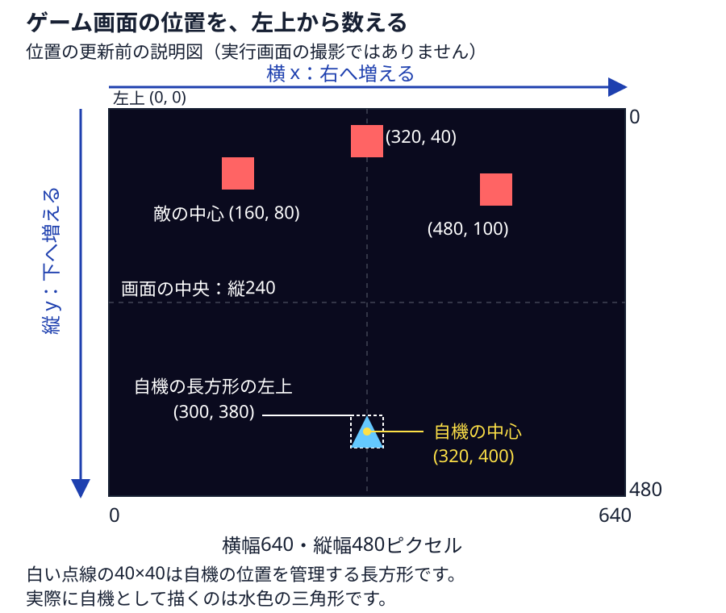

# Pg5. pygame「敵を実装する」

Pg4では、プレイヤーから弾を撃てるようになりました。

でも、まだ何も倒せません。

> **「撃てるようになった。で、何を撃つん？？？」**

今回のプログラムは、画面上から敵を出し、弾が当たると敵を消します。

ここまで来ると、一気にシューティングゲームらしくなります。

---


## Pythonファイルの保存場所

この章のPythonファイルは、練習用フォルダ内の `src` へ保存してください。

この章のコードを保存する練習用フォルダを1つ選んでください。まだない場合は、保存したい場所で、Windowsはエクスプローラーの **新規作成 → フォルダー**、macOSはFinderの **ファイル → 新規フォルダ**、Linux（GNOMEの「ファイル」）は右クリックの **新しいフォルダー** を選び、練習用フォルダを作ってください。

練習用フォルダの中で、Windowsはエクスプローラーの空いている場所を右クリックして **新規作成 → フォルダー**、macOSはFinderの **ファイル → 新規フォルダ**、Linux（GNOMEの「ファイル」）は空いている場所を右クリックして **新しいフォルダー** を選んでください。フォルダ名を `src` と入力してEnterキーを押すと、練習用フォルダの中に `src` ができます。すでに `src` がある場合はそのフォルダを使い、保存済みのコードは必要な変更だけを行ってください。

VS Codeで開くフォルダと、ターミナルの `cd` で移動するフォルダは、`src` の一つ上の練習用フォルダです。保存先を選ぶときは `src` を開き、起動するときは練習用フォルダから `src/main.py` を指定してください。実行手順のコマンドは、この練習用フォルダから入力してください。

専用のPythonを用意する `.venv` は、`src` の一つ上の練習用フォルダに置いてください。

## この章のファイルを保存する

下のリンクを1つずつ開き、GitHubの **Raw** でコードだけを表示してください。全体をコピーし、VS Codeの新しいファイルへ貼り付けて、表と同じ名前で、練習用フォルダ内の `src` へ保存してください。Windows / LinuxはCtrl + A、Ctrl + C、Ctrl + N、Ctrl + V、Ctrl + S、macOSは対応するCommandキーの操作を使ってください。

実行用コードがある章では、起動するファイルを `main.py` に揃えています。Pg15は次の学習先を選ぶ案内ページなので、実行用コードはありません。`main.py` はpygameを使う準備をし、`game.py` の `Game` を起動します。各章で追加するゲームの機能は、`game.py`、`battle.py`、`enemy.py` など役割を持つファイルに書きます。`main.py` は変更せず、補助ファイルはこの章の版で揃えて保存してください。この章だけを保存して動かせます。

| ファイル | 役割 | 前章からの違い |
| --- | --- | --- |
| [main.py](./src/main.py) | `main.py` はpygameを使う準備をし、`game.py` のゲーム全体の処理を開始します | 同じ |
| [battle.py](./src/battle.py) | Battle（戦闘）：自機・敵・弾の一覧を持ち、入力・移動・重なりの確認・描画を行う | 変更 |
| [bullet.py](./src/bullet.py) | Bullet（弾）：弾1発の位置・移動・画面外の確認・描画 | 処理は同じ |
| [collisions.py](./src/collisions.py) | collisions（衝突）：弾と敵が重なったかを調べ、重なった弾と敵を一覧から外す | 追加 |
| [enemy.py](./src/enemy.py) | Enemy（敵）：赤い四角形の敵の位置・移動・画面外の確認・描画 | 追加 |
| [game.py](./src/game.py) | Game（ゲーム全体）：ウィンドウ・画面更新の速さ・ゲームの繰り返し | 変更 |
| [player.py](./src/player.py) | Player（プレイヤー）：操作する自機の位置・移動・発射・描画 | 処理は同じ |
| [settings.py](./src/settings.py) | settings（設定）：画面の幅・高さ・更新回数の上限、自機の初期位置、自機・弾・敵の移動量をまとめる | 変更 |


**実行するファイルは `main.py` です。**

## 起動してから1回の更新が終わるまで

`main.py` を実行すると、PythonはPygameを準備して `Game.run()` を始めます。`Game.run()` は、ウィンドウを閉じる操作を確認し、戦闘中の自機・敵・弾の状態を更新して、描いた画面を表示します。画面更新の速さは `self.clock.tick(settings.FPS)` で1秒あたり最大 `settings.FPS` 回に抑えます。

`self` はそのクラスから作ったもの自身です。`self.player` はその戦闘が持つ自機、`self.bullets` はその戦闘が持つ弾の一覧です。`__init__` は作るときの初期値を用意します。`from player import Player` は同じフォルダのplayer.pyから自機の型を読み込む指定です。

`main.py` を直接実行すると、Pythonは `main()` を動かし、`game.py` の `Game` がゲーム画面を開きます。別のPythonファイルから `main.py` を読み込んだだけでは、`main()` は動かず、ウィンドウも開きません。読者がウィンドウの閉じるボタンを押すと、`Game.handle_events()` は `pygame.event.get()` から閉じる操作の知らせ `pygame.QUIT` を受け取り、`self.running` を `False` にします。`Game.run()` はその値を見て画面更新の繰り返しを終え、`main.py` に戻ります。

`main.py` の `try:` の下にはゲームの起動と実行を書きます。Pythonはその処理が正常に終わった場合も途中でエラーが起きた場合も、`finally:` の下にある `pygame.quit()` を実行してPygameを終了します。エラーが起きた場合は、Pygameを終了してからPythonがエラーを表示します。

### 起動用の `main.py`

このコードの元ファイル：[`main.py` の 1〜24行](./src/main.py#L1-L24)。

```python
# pygame を読み込む
import pygame
# game から Game を読み込む
from game import Game

# main の処理を定義する
def main():
    # pygame.init() を実行する
    pygame.init()
    # Pythonは try: の処理が終わったときもエラーで中断したときも、finally: の下の pygame.quit() を実行する
    try:
        # game はゲーム全体を表し、ゲーム画面や実行状態を持ちます。
        # game に Game() を入れる
        game = Game()
        # game.run() を実行する
        game.run()
    finally:
        # pygameを終了する
        pygame.quit()

# このファイルを直接実行したときだけ main() を実行する
if __name__ == "__main__":
    # main() を実行する
    main()
```

## 敵が登場する時点で `Enemy` を作る

敵も、自機と同じように位置と描く処理を持ちます。敵だけを `[x, y]` で表すと、`enemy[1]` が何なのかを毎回読み解く必要があります。最初に敵を出すこの章から `Enemy`（敵）を使います。

`Enemy(160, 80)` は中心をx=160、y=80に置いた敵1機です。`enemies`（敵の一覧）には3機を入れています。各敵の `move()` はyを `ENEMY_SPEED = 1` の分だけ増やし、下へ動かします。敵の形は40×40ピクセルの四角形です。

敵の移動処理へ弾との当たり判定まで加えると、敵が動く理由と弾が消える理由が一緒になって追いにくくなります。この章では、弾と敵が重なったときの判定・削除を `collisions.py`（衝突の処理）の `hit_enemies`（敵に命中）にまとめます。

`bullet.rect.colliderect(enemy.rect)` は2つの長方形が重なっているかを返します。重なったときは弾と敵を一覧から削除します。

削除中に一覧の順番がずれないよう、`bullets[:]` と `enemies[:]` のコピーを読んでいます。`break` はその弾についての敵探しを終える指定です。1発を複数の敵へ重複して命中させません。

## 設定値の場所と意味

「敵がゆっくりすぎる。敵の動く量だけ変えたい！」というとき、移動の処理から数値を探して直すのは手間です。`settings.py` のsettingsは「設定」の意味で、ゲームの大きさ・最初の位置・動く量に名前を付けてまとめるファイルです。

たとえば `ENEMY_SPEED = 1` の `=` は、右の数値1を、左の名前 `ENEMY_SPEED`（敵の移動量）へ設定する書き方です。`enemy.py` は `import settings` で設定ファイルを読み込み、`settings.ENEMY_SPEED` で敵の移動量を使います。敵の設定値を2へ変えて再起動すると、敵を動かす処理も2を使います。

画面の高さも、画面を作る `game.py` と画面外を調べる `enemy.py` が、`settings.HEIGHT`（画面の高さ）を使います。各ファイルへ480を別々に書かず、同じ設定名を使うので、高さを変えるときは設定ファイルの1か所を直せます。

### 設定ファイル全体を保存する

1. VS Codeの左側のファイル一覧で `src/settings.py` をクリックしてください。ゲームの設定値が編集画面に表示されます。
2. `src/settings.py` の編集画面をクリックし、Windows / LinuxはCtrl + A、macOSはCommand + Aを押してください。設定ファイルのコード全体が選ばれます。
3. 以下のコード全体をコピーし、選択済みの編集画面へWindows / LinuxはCtrl + V、macOSはCommand + Vで貼り付けてください。設定ファイル全体が、値の意味を説明するコメント付きのコードへ置き換わります。
4. Windows / LinuxはCtrl + S、macOSはCommand + Sで `src/settings.py` を保存してください。初期設定の数値は元のままです。

元ファイル：[`settings.py` 全体](./src/settings.py)。

```python
# settingsは「設定」の意味。settings.pyへゲーム画面の大きさ・自機の初期位置・移動量をまとめます。
# game.py、player.py、enemy.py、bullet.pyがimport settingsで、settings.pyの設定を読み込みます。
# 同じ画面の高さを各ファイルへ別々に書くと、変更する場所を探して直す必要があります。
# HEIGHT（高さ）のように値へ名前を付けると、画面を作る処理と画面外の判定が同じ設定を使えます。
# =は右側の値を左側の名前へ設定する書き方です。WIDTH（幅）= 640は横幅の設定へ640を指定します。
# ピクセルはゲーム画面の位置や大きさを数える単位で、1ピクセルはゲーム画面上の点1つ分です。
# ゲーム画面の左上は横0・縦0。ゲーム画面では横の値は右へ、縦の値は下へ進むほど増えます。
# 画面更新1回は、game.pyが自機・弾・敵を動かし、動いた位置で描いて表示する1巡です。

# WIDTH（幅）はゲーム画面の横幅。game.pyが幅640ピクセルの画面を作ります。
WIDTH = 640
# HEIGHT（高さ）はゲーム画面の縦幅。game.pyが高さ480ピクセルの画面を作ります。
# enemy.pyとbullet.pyもHEIGHTを読み、機体や弾が画面の下へ出たかを調べます。
HEIGHT = 480

# FPSはframes per second（1秒あたりの画面更新回数）の略。game.pyが更新回数の上限に使います。
# game.pyはclock.tick(settings.FPS)へ60を指定し、速すぎる更新を待たせます。FPS=60は毎秒60回の更新を保証しません。
# 敵は更新1回ごとに動くので、毎秒30回しか更新できない場合は毎秒60回の場合より遅く動きます。
FPS = 60

# PLAYER（プレイヤー）は操作する自機、Xは横の位置。PLAYER_Xは自機の最初の横の中心位置です。
# player.pyが自機の中心を、ゲーム画面の左端から右へ320ピクセルの場所へ置きます。
PLAYER_X = 320
# Yは縦の位置。PLAYER_Yは自機の最初の縦の中心位置です。
# player.pyが自機の中心を、ゲーム画面の上端から下へ400ピクセルの場所へ置きます。
# 自機の幅・高さはplayer.pyの40ピクセルなので、中心(320, 400)に置くと左上は(300, 380)です。
PLAYER_Y = 400

# SPEED（スピード）は速さの指定。PLAYER_SPEEDは自機が更新1回で横・縦それぞれに進む量です。
# player.pyは押した矢印に応じて、自機の横または縦の位置へ5ピクセルを足す・引く処理をします。
# 画面端に触れていなければ、右と上を同時に押すと横へ5・縦へ-5進み、斜めの距離は約7.1ピクセルで1方向だけより速く動きます。
# 画面端ではplayer.pyが自機を画面内へ戻すため、自機の実際の移動量は5より小さくなる場合があります。
PLAYER_SPEED = 5

# BULLET（弾）は自機が撃つ弾。BULLET_SPEEDは更新1回で弾が縦に進む量の大きさです。
# player.pyは8へ負の符号を付けて-8とし、弾1発の情報を作るbullet.pyへ指定します。
# bullet.pyは弾の縦の位置へ-8を足すので、縦の値が8減り、弾は上へ8ピクセル進みます。
BULLET_SPEED = 8

# ENEMY（エネミー）は敵。この章では開始時に3機置く赤い四角形で、ボスや敵の弾はまだありません。
# ENEMY_SPEEDは敵が更新1回で下へ進む量（ピクセル）。enemy.pyが敵の縦の位置へ1を足します。
# ENEMY_SPEEDを2にして再起動すると、敵は同じ1回の更新で下へ2ピクセル進みます。
# 毎秒60回更新できる場合、敵は設定1なら毎秒約60、設定2なら毎秒約120ピクセル進みます。
ENEMY_SPEED = 1
```

### 設定名と、その値を使う処理

ピクセルはゲーム画面の位置や大きさを数える単位で、1ピクセルはゲーム画面上の点1つ分です。次の表の「1回の更新」は、自機・弾・敵の位置を進め、その位置で画面を描いて表示する1巡を指します。

| 設定名と英語の意味 | 初期値と、画面で変わるもの | 値を使うファイルの出典 |
| --- | --- | --- |
| `WIDTH`：幅 | `640`ピクセル。ゲーム画面の横幅 | [`game.py` 10〜13行](./src/game.py#L10-L13) |
| `HEIGHT`：高さ | `480`ピクセル。ゲーム画面の縦幅と、敵・弾が下へ出る位置 | [`game.py` 10〜13行](./src/game.py#L10-L13)、[`enemy.py` 23〜27行](./src/enemy.py#L23-L27)、[`bullet.py` 27〜30行](./src/bullet.py#L27-L30) |
| `FPS`：frames per second、1秒あたりの画面更新回数 | `60`回/秒が更新回数の上限。実際に毎秒60回更新できるという保証ではない | [`game.py` 33〜52行](./src/game.py#L33-L52) |
| `PLAYER_X`：playerは自機、xは横の位置 | `320`ピクセル。自機の最初の中心をゲーム画面の左端から右へ320に置く | [`player.py` 11〜16行](./src/player.py#L11-L16) |
| `PLAYER_Y`：playerは自機、yは縦の位置 | `400`ピクセル。自機の最初の中心をゲーム画面の上端から下へ400に置く | [`player.py` 11〜16行](./src/player.py#L11-L16) |
| `PLAYER_SPEED`：playerは自機、speedは速さの指定 | `5`ピクセル/回。押した矢印ごとに横・縦の位置を5増やす・減らす | [`player.py` 18〜41行](./src/player.py#L18-L41) |
| `BULLET_SPEED`：bulletは弾、speedは速さの指定 | `8`ピクセル/回。自機の発射時に負の符号を付け、弾を上へ8進める | [`player.py` 42〜47行](./src/player.py#L42-L47)、[`bullet.py` 17〜25行](./src/bullet.py#L17-L25) |
| `ENEMY_SPEED`：enemyは敵、speedは速さの指定 | `1`ピクセル/回。開始時に置く赤い四角形の敵を下へ1進める | [`enemy.py` 16〜22行](./src/enemy.py#L16-L22) |

### ゲーム画面の左上と、自機の中心

ゲーム画面の左上が横0・縦0です。横の位置を表すxは右へ進むほど増え、縦の位置を表すyは下へ進むほど増えます。`PLAYER_X = 320` と `PLAYER_Y = 400` が指定するのは、自機の**中心**です。



図は、[`player.py` 11〜16行](./src/player.py#L11-L16)と[`battle.py` 26〜32行](./src/battle.py#L26-L32)で自機・敵を置いた、位置の更新前の説明図です。実行画面を撮影したものではありません。ゲームは最初に描く前にも敵を動かすため、実際の最初の描画では敵の縦の中心が設定1の場合は81・41・101になります。

自機は幅40・高さ40ピクセルの長方形で位置を持つので、中心から幅・高さの半分20を引くと、左端は `320 - 20 = 300`、上端は `400 - 20 = 380` です。ゲーム画面の縦の中央は `480 ÷ 2 = 240` なので、自機の中心400は画面の中央より下にあります。[pygame-ce公式：長方形の中心と辺](https://pyga.me/docs/ref/rect.html)

### 1回の移動量と、1秒間の動きを分ける

[`game.py` 33〜52行](./src/game.py#L33-L52)は、自機・弾・敵の位置を更新し、その位置で描いて表示します。最後の `self.clock.tick(settings.FPS)` は、`settings.py` の `FPS = 60` を使い、更新が速すぎる場合に待つ処理です。PCの処理が遅い場合に、足りない更新を増やして毎秒60回へそろえる処理ではありません。[pygame-ce公式：更新回数を制限する](https://pyga.me/docs/ref/time.html#pygame.time.Clock.tick)

`settings.py` の `ENEMY_SPEED = 1` は、敵が1回の更新で下へ1ピクセル進む指定です。`enemy.py` は敵の移動量1を使うので、毎秒60回更新できる場合は約60ピクセル/秒、毎秒30回の場合は約30ピクセル/秒になります。この章では経過した秒数に合わせて移動量を補う処理がないため、更新が遅いと、同じ1秒間に敵が進む距離も短くなります。

`settings.py` の `PLAYER_SPEED = 5` は、`player.py` が使う横・縦それぞれの移動量です。画面端に触れていない場所で右と上を同時に押すと、自機は横へ5・縦へ-5ピクセル進みます。移動前と移動後の位置を直線で結んだ距離は、右だけを押す場合は5ピクセル、右上へ斜めに動く場合は約7.1ピクセルです。同じ更新回数でも、斜めの移動は1方向だけの場合より約1.4倍速く見えます。この章では斜めの移動量を短くして、1方向の速さへそろえる処理はありません。

### 弾の負の符号と、敵の正の移動量

[`player.py` 42〜47行](./src/player.py#L42-L47)は、`settings.py` の `BULLET_SPEED = 8` を `-settings.BULLET_SPEED` で-8にし、自機が撃つ弾へ指定します。負の符号は、縦の位置を減らす方向の指定です。弾の縦の位置へ-8を足すと、ゲーム画面では弾が上へ8ピクセル進みます。

[`enemy.py` 16〜22行](./src/enemy.py#L16-L22)は、`settings.py` の `ENEMY_SPEED = 1` を敵の縦の位置へ足します。敵の縦の中心が80なら、1回の更新後は81です。正の1を足すので、ゲーム画面では下へ1ピクセル進みます。この章の敵は開始時に3機置く赤い四角形で、敵の弾・ボス・追加で敵を出す間隔の設定はまだありません。

### `enemy.py` の `Enemy`

[`enemy.py` の6〜32行](./src/enemy.py#L6-L32)にある `Enemy` の定義を、下のコードに置き換えてください。

`settings.py` の `ENEMY_SPEED = 1` により、開始時に置く赤い四角形の敵は画面更新1回につき下へ1ピクセル進みます。`settings.py` の `HEIGHT = 480` はゲーム画面の高さで、敵の上端が480ピクセルを越えると `Enemy.is_off_screen()` が画面外と判定します。

このコードの元ファイル：[`enemy.py` の 6〜32行](./src/enemy.py#L6-L32)。

```python
# Enemy という型を定義する
class Enemy:
    # __init__ の処理を定義する
    def __init__(self, x, y):
        # rect はrectangle（長方形）の略。位置・大きさと当たり判定に使います。
        # self.rect に pygame.Rect(0, 0, 40, 40) を入れる
        self.rect = pygame.Rect(0, 0, 40, 40)
        # self.rect.center に (x, y) を入れる
        self.rect.center = (x, y)
        # speed は速さ。1回の更新で動く距離で、単位はピクセルです。
        # self.speed に settings.ENEMY_SPEED を入れる
        self.speed = settings.ENEMY_SPEED

    # move の処理を定義する
    def move(self):
        # self.rect.y に self.speed を足す
        self.rect.y += self.speed

    # is_off_screen の処理を定義する
    def is_off_screen(self):
        # self.rect.top > settings.HEIGHT を返す
        return self.rect.top > settings.HEIGHT

    # draw の処理を定義する
    def draw(self, screen):
        # pygame.draw.rect(screen, (255, 100, 100), self.rect) を実行する
        pygame.draw.rect(screen, (255, 100, 100), self.rect)
```

### `collisions.py` の `hit_enemies`

[`collisions.py` の1〜14行](./src/collisions.py#L1-L14)にある `hit_enemies` の定義を、下のコードに置き換えてください。

このコードの元ファイル：[`collisions.py` の 1〜14行](./src/collisions.py#L1-L14)。

```python
# hit_enemies の処理を定義する
def hit_enemies(bullets, enemies):
    # bullets[:] から bullet を1つずつ取り出して繰り返す
    for bullet in bullets[:]:
        # enemies[:] から enemy を1つずつ取り出して繰り返す
        for enemy in enemies[:]:
            # bullet.rect.colliderect(enemy.rect) が成り立つなら
            if bullet.rect.colliderect(enemy.rect):
                # bullets.remove(bullet) を実行する
                bullets.remove(bullet)
                # enemies.remove(enemy) を実行する
                enemies.remove(enemy)
                # この繰り返しを終える
                break
```

## 実行したときの画面と操作

3機の赤い敵が下へ動きます。自機の弾が重なった敵は消えます。

キー操作はゲームのウィンドウをクリックしてから行ってください。

Spaceキーは押して離すたびに1発出ます。矢印キーは押している間、移動します。

## 保存先へ移動して `main.py` を実行する

VS Codeの **ファイル（File）→ フォルダーを開く（Open Folder）** から、この章の `src` が入っている練習用フォルダを開いてください。

フォルダの場所を書いた文字列を「パス」と呼びます。コピー元は、Pythonファイルを入れた `src` の一つ上にある練習用フォルダです。`src` 自体のパスはコピーしないでください。

- Windows：エクスプローラーで `src` の一つ上の練習用フォルダを開き、上部のアドレス欄をクリックして、パス全体をCtrl + Cでコピーしてください。
- macOS：Finderで `src` の一つ上の練習用フォルダを選び、Option + Command + Cでパスをコピーしてください。
- Linux（GNOMEのファイル）：`src` の一つ上の練習用フォルダを開き、Ctrl + Lで場所の欄を表示してCtrl + Cでコピーしてください。

VS Codeの **表示（View）→ ターミナル（Terminal）** を開いてください。次の引用符の中を、いまコピーした保存先のパスへ置き換えて入力し、Enterキーを押してください。WindowsはCtrl + V、macOSはCommand + V、LinuxはCtrl + Shift + Vで貼り付けてください。

```text
cd "コピーした保存先フォルダのパス"
```

このフォルダにゲーム用のPython実行環境 `.venv` がまだなければ、次の作成と追加を行ってください。pygame-ceは画面描画や入力に使う追加の道具です。インストールする名前は `pygame-ce`、コードで読み込む名前は `pygame` です。既にこのフォルダの `.venv` に追加済みなら、実行のコマンドへ進んでください。

### Windows

VS Codeの **表示 → ターミナル** で同じターミナルを表示してください。次を1行ずつ入力し、その都度Enterキーを押してください。1行目が終わってから2行目へ進んでください。

```text
python -m venv .venv
.\.venv\Scripts\python.exe -m pip install pygame-ce
```

`-m venv` は専用のPython実行環境を作る指定、`-m pip install` はそのPythonへ道具を追加する指定です。追加にはインターネット接続が必要です。

VS Codeの **表示 → ターミナル** で同じターミナルを表示し、次を入力してEnterキーを押してください。

```text
.\.venv\Scripts\python.exe src/main.py
```

### macOS / Linux

VS Codeの **表示 → ターミナル** で同じターミナルを表示してください。次を1行ずつ入力し、その都度Enterキーを押してください。1行目が終わってから2行目へ進んでください。

```text
python3 -m venv .venv
.venv/bin/python -m pip install pygame-ce
```

VS Codeの **表示 → ターミナル** で同じターミナルを表示し、次を入力してEnterキーを押してください。

```text
.venv/bin/python src/main.py
```

ウィンドウを閉じるとプログラムが終了します。`No module named pygame` なら追加と実行に同じ `.venv` のPythonを使っているか確認してください。補助ファイル名が出て `No module named ...` となる場合は、上のファイル一覧から保存漏れを探してください。

## 1か所変えて比べる

敵の移動量は、[`enemy.py` 16〜17行](./src/enemy.py#L16-L17)で敵を作るときに読み込まれます。`settings.py` を保存しただけでは、起動中の敵が持つ移動量は変わりません。次の操作でゲームを終了し、設定を変えて起動し直してください。

1. 起動中なら、ゲームのウィンドウの閉じるボタンを押してください。ゲームが終了し、実行したターミナルがコマンドを入力できる状態へ戻ります。
2. VS Codeの左側のファイル一覧で `src/settings.py` を開き、編集画面でWindows / LinuxはCtrl + F、macOSはCommand + Fを押してください。コード内の検索欄が表示されます。検索欄へ `ENEMY_SPEED = 1` と入力すると、敵の移動量の設定行が見つかります。
3. 検索した `ENEMY_SPEED = 1` の右側の1を2へ変え、`ENEMY_SPEED = 1` の直前のコメントにある「縦の位置へ1を足します」を「縦の位置へ2を足します」に変更してください。Windows / LinuxはCtrl + S、macOSはCommand + Sで `src/settings.py` を保存してください。次の起動で敵の移動量2が使われます。
4. VS Codeの **表示 → ターミナル** で、この章を実行したターミナルを表示してください。Windowsは `.\.venv\Scripts\python.exe src/main.py`、macOS / Linuxは `.venv/bin/python src/main.py` を入力してEnterキーを押してください。赤い3機の敵が初期位置から再び現れ、同じ更新回数なら変更前の2倍の距離を下へ進みます。弾を撃たず、敵が下へ移動する様子を比べてください。

| 比べる条件 | `ENEMY_SPEED = 1` | `ENEMY_SPEED = 2` |
| --- | --- | --- |
| 中心の縦位置80の敵を、1回更新する | 中心が81へ進む | 中心が82へ進む |
| 中心の縦位置80の敵を、60回更新する（弾が当たらない場合） | 中心が140へ進む | 中心が200へ進む |
| 毎秒60回更新できる場合の、1秒間の移動 | 下へ約60ピクセル | 下へ約120ピクセル |

5. 比べ終わったらゲームの閉じるボタンを押してください。ゲームが終了し、ターミナルが入力待ちへ戻ります。
6. VS Codeの `src/settings.py` で `ENEMY_SPEED = 2` の右側を1へ戻し、変更したコメントも「縦の位置へ1を足します」へ戻してください。Windows / LinuxはCtrl + S、macOSはCommand + Sで保存すると、配布時の敵の移動量1に戻ります。
7. VS Codeの **表示 → ターミナル** で同じターミナルを表示し、Windowsは `.\.venv\Scripts\python.exe src/main.py`、macOS / Linuxは `.venv/bin/python src/main.py` を入力してEnterキーを押してください。敵が更新1回につき下へ1ピクセル進む、最初の設定のゲームが起動します。次章へ進む前に、ゲームの閉じるボタンを押してください。ゲームが終了し、ターミナルが入力待ちへ戻ります。

## このルートの移動

← [Pg4. 弾を発射する](../Pg04_弾を発射する/弾を発射する.md)

[9. 進みたい方を選ぼうへ戻る](../09_進みたい方を選ぼう/進みたい方を選ぼう.md)

[Pg6. 敵が攻撃してくる](../Pg06_敵が攻撃してくる/敵が攻撃してくる.md) →
